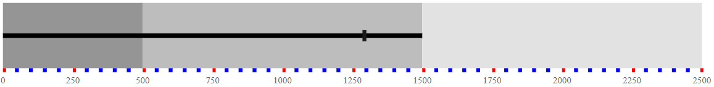
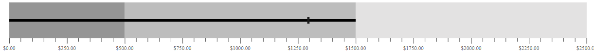
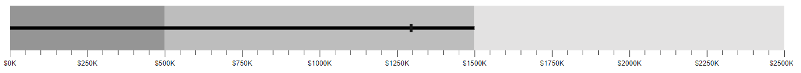
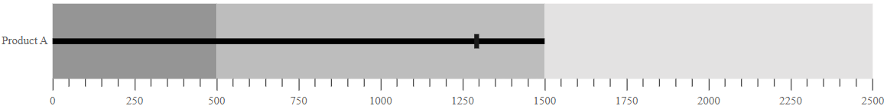
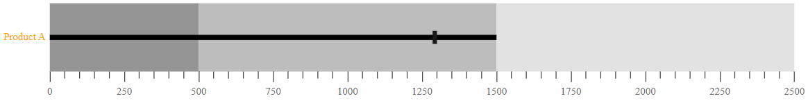

# Axis customization in Bullet Chart Control

## MajorTickLines and MinorTickLines customization

You can customize the [`Width`](https://help.syncfusion.com/cr/aspnetcore-js2/Syncfusion.EJ2.Charts.BulletChartMajorTickLines.html#Syncfusion_EJ2_Charts_BulletChartMajorTickLines_Width), [`Color`](https://help.syncfusion.com/cr/aspnetcore-js2/Syncfusion.EJ2.Charts.BulletChartMajorTickLines.html#Syncfusion_EJ2_Charts_BulletChartMajorTickLines_Color), and [`Height`](https://help.syncfusion.com/cr/aspnetcore-js2/Syncfusion.EJ2.Charts.BulletChartMajorTickLines.html#Syncfusion_EJ2_Charts_BulletChartMajorTickLines_Height) of minor and major tick lines using the [`MajorTickLines`](https://help.syncfusion.com/cr/aspnetcore-js2/Syncfusion.EJ2.Charts.BulletChartMajorTickLines.html) and [`MinorTickLines`](https://help.syncfusion.com/cr/aspnetcore-js2/Syncfusion.EJ2.Charts.BulletChartMinorTickLines.html) properties of the bullet chart.

The following properties can be used to customize `MajorTicklines` and `MinorTicklines`.

* **Width** - Specifies the width of ticklines.
* **Height** - Specifies the height of ticklines.
* **Color** - Specifies the color of ticklines.
* **UseRangeColor** - Specifies the color of ticklines and represents the color from corresponding range colors.






...
public class TicklinesData
{
    public double value;
    public double target;
}



## Tick placement

The major and the minor ticks can be placed **Inside** or **Outside** the ranges using the [`TickPosition`](https://help.syncfusion.com/cr/aspnetcore-js2/Syncfusion.EJ2.Charts.BulletChart.html#Syncfusion_EJ2_Charts_BulletChart_TickPosition) property.






...
public class Position
{
    public double value;
    public double target;
}



## Label format

Axis numeric labels can be formatted by using the [`LabelFormat`](https://help.syncfusion.com/cr/aspnetcore-js2/Syncfusion.EJ2.Charts.BulletChart.html#Syncfusion_EJ2_Charts_BulletChart_LabelFormat) property. Axis labels support all globalize formats.






...
public class FormatData
{
    public double value;
    public double target;
}



The following table describes the result of applying some commonly used formats to numeric axis labels.

<!-- markdownlint-disable MD033 -->
<table>
<tr>
<td><b>Label Value</b></td>
<td><b>Label Format property value</b></td>
<td><b>Result </b></td>
<td><b>Description </b></td>
</tr>
<tr>
<td>1000</td>
<td>n1</td>
<td>1000.0</td>
<td>The Number is rounded to 1 decimal place</td>
</tr>
<tr>
<td>1000</td>
<td>n2</td>
<td>1000.00</td>
<td>The Number is rounded to 2 decimal places</td>
</tr>
<tr>
<td>1000</td>
<td>n3</td>
<td>1000.000</td>
<td>The Number is rounded to 3 decimal places</td>
</tr>
<tr>
<td>0.01</td>
<td>p1</td>
<td>1.0%</td>
<td>The Number is converted to percentage with 1 decimal place</td>
</tr>
<tr>
<td>0.01</td>
<td>p2</td>
<td>1.00%</td>
<td>The Number is converted to percentage with 2 decimal places</td>
</tr>
<tr>
<td>0.01</td>
<td>p3</td>
<td>1.000%</td>
<td>The Number is converted to percentage with 3 decimal places</td>
</tr>
<tr>
<td>1000</td>
<td>c1</td>
<td>$1000.0</td>
<td>The Currency symbol is appended to number and number is rounded to 1 decimal place</td>
</tr>
<tr>
<td>1000</td>
<td>c2</td>
<td>$1000.00</td>
<td>The Currency symbol is appended to number and number is rounded to 2 decimal places</td>
</tr>
</table>

## Grouping separator

To separate groups of thousands, use the [`EnableGroupSeparator`](https://help.syncfusion.com/cr/aspnetcore-js2/Syncfusion.EJ2.Charts.BulletChart.html#Syncfusion_EJ2_Charts_BulletChart_EnableGroupSeparator) property of bullet-chart. To separate the groups of thousands, set the `EnableGroupSeparator` property to **true**.






...
public class Separator
{           
    public double value;
    public double target;
}



## Custom label format

Using the [`LabelFormat`](https://help.syncfusion.com/cr/aspnetcore-js2/Syncfusion.EJ2.Charts.BulletChart.html#Syncfusion_EJ2_Charts_BulletChart_LabelFormat) property, axis labels can be specified with a custom defined format in addition to the axis value. The label format uses a placeholder such as **${value}K**, which represents the axis label.






...
public class CustomFormatData
{           
    public double value;
    public double target;
}



## Label placement

You can customize the axis labels **Inside** or **Outside** the bullet chart using the [`LabelPosition`](https://help.syncfusion.com/cr/aspnetcore-js2/Syncfusion.EJ2.Charts.BulletChart.html#Syncfusion_EJ2_Charts_BulletChart_LabelPosition) property.






...
public class Placement
{           
    public double value;
    public double target;
}



## Opposed position

To place an axis opposite to its original position, set the [`OpposedPosition`](https://help.syncfusion.com/cr/aspnetcore-js2/Syncfusion.EJ2.Charts.BulletChart.html#Syncfusion_EJ2_Charts_BulletChart_OpposedPosition) property to **true**.






...
public class OpposedPositionData
{           
    public double value;
    public double target;
}



## Category label

The Bullet Chart supports X-axis label by specifying the property from the data source to the [`CategoryField`](https://help.syncfusion.com/cr/aspnetcore-js2/Syncfusion.EJ2.Charts.BulletChart.html#Syncfusion_EJ2_Charts_BulletChart_CategoryField). It helps to understand the input data in a more efficient way.






...
public class Category
{           
    public double value;
    public double target;
    public string category;
}



## Category label customization

The label color, opacity, font size, font family, font weight, and font style can be customized by using the [`CategoryLabelStyle`](https://help.syncfusion.com/cr/aspnetcore-js2/Syncfusion.EJ2.Charts.BulletChart.html#Syncfusion_EJ2_Charts_BulletChart_CategoryLabelStyle) setting for category and the [`LabelStyle`](https://help.syncfusion.com/cr/aspnetcore-js2/Syncfusion.EJ2.Charts.BulletChart.html#Syncfusion_EJ2_Charts_BulletChart_LabelStyle) setting for axis label. The [`UseRangeColor`](https://help.syncfusion.com/cr/aspnetcore-js2/Syncfusion.EJ2.Charts.BulletChartBulletLabelStyle.html#Syncfusion_EJ2_Charts_BulletChartBulletLabelStyle_UseRangeColor) property specifies the color of the axis label and represents the color from the corresponding range colors.






...
public class CustomCategory
{           
    public double value;
    public double target;
    public string category;
}



