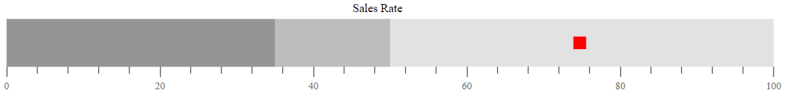

# Target bar in Bullet Chart Control

The line marker that runs perpendicular to the orientation of the graph is known as the **Comparative Measure** and it is used as a target marker to compare against the feature measure value. This is also called as the **Target Bar** in the Bullet Chart. To display the target bar, the [`TargetField`](https://help.syncfusion.com/cr/aspnetcore-js2/syncfusion.ej2.charts.bulletchart.html#Syncfusion_EJ2_Charts_BulletChart_TargetField) should be mapped to the appropriate field from the datasource.






...
public class TargetBarData
{           
    public double value;
    public double target;
}



## Types of target bar

The shape of the target bar can be customized using the [`TargetTypes`](https://help.syncfusion.com/cr/aspnetcore-js2/syncfusion.ej2.charts.bulletchart.html#Syncfusion_EJ2_Charts_BulletChart_TargetTypes) property and it supports **Circle**, **Cross**, and **Rect** shapes. The default type of the target bar is **Rect**.






...
public class TargetType
{           
    public double value;
    public double target;
}



## Target bar customization

The following properties can be used to customize the target bar. Also, you can bind the color for the target bar from [`DataSource`](https://help.syncfusion.com/cr/aspnetcore-js2/syncfusion.ej2.charts.bulletchart.html#Syncfusion_EJ2_Charts_BulletChart_DataSource) for the bullet chart.

* [`TargetColor`](https://help.syncfusion.com/cr/aspnetcore-js2/syncfusion.ej2.charts.bulletchart.html#Syncfusion_EJ2_Charts_BulletChart_TargetColor) - Specifies the fill color of target bar.
* [`TargetWidth`](https://help.syncfusion.com/cr/aspnetcore-js2/syncfusion.ej2.charts.bulletchart.html#Syncfusion_EJ2_Charts_BulletChart_TargetWidth) - Specifies the width of target bar.






...
public class TargetBarCustomization
{           
    public double value;
    public double target;
}



