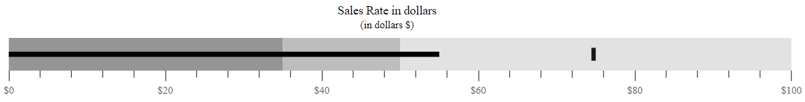
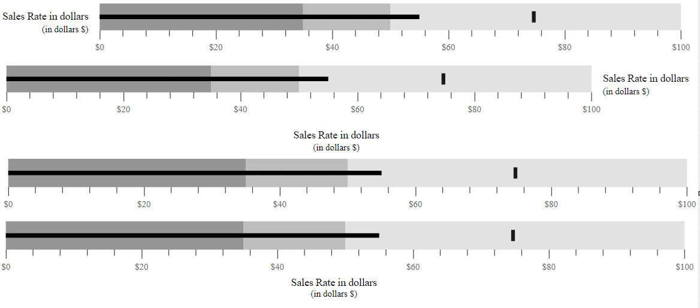

# Title and subtitle in Bullet Chart Control

## Title

The title of the Bullet Chart displays the information about the data plotted by specifying it in the [`Title`](https://help.syncfusion.com/cr/aspnetcore-js2/Syncfusion.EJ2.Charts.BulletChart.html#Syncfusion_EJ2_Charts_BulletChart_Title) property.






...
public class DefaultBulletData
{           
    public double value;
    public double target;
}



## Subtitle

To show additional information about the data plotted, the Bullet Chart can also be given a subtitle using the [`Subtitle`](https://help.syncfusion.com/cr/aspnetcore-js2/Syncfusion.EJ2.Charts.BulletChart.html#Syncfusion_EJ2_Charts_BulletChart_Subtitle) property.






...
public class SubTitleData
{           
    public double value;
    public double target;
}



## Title and subTitle position

The title and the subtitle positions can be customized using the [`TitlePosition`](https://help.syncfusion.com/cr/aspnetcore-js2/Syncfusion.EJ2.Charts.BulletChart.html#Syncfusion_EJ2_Charts_BulletChart_TitlePosition) property. Possible positions are **Left**, **Right**, **Top**, and **Bottom**.

### Position as left

By setting the `titlePosition` to **Left**, you can display the title and subtitle at the left side of the Bullet Chart.






...
public class Position
{           
    public double value;
    public double target;
}



### Position as right

By setting the [`TitlePosition`](https://help.syncfusion.com/cr/aspnetcore-js2/Syncfusion.EJ2.Charts.BulletChart.html#Syncfusion_EJ2_Charts_BulletChart_TitlePosition) to **Right**, you can display the title and subtitle at the right side of the Bullet Chart.






...
public class RightPositionData
{           
    public double value;
    public double target;
}



### Position as top

By setting the [`TitlePosition`](https://help.syncfusion.com/cr/aspnetcore-js2/Syncfusion.EJ2.Charts.BulletChart.html#Syncfusion_EJ2_Charts_BulletChart_TitlePosition) to **Top**, you can display the title and subtitle at the top of the Bullet Chart. The default title and subtitle positions of the Bullet Chart is **Top**.






...
public class TopPositionData
{           
    public double value;
    public double target;
}



### Position as bottom

By setting the [`TitlePosition`](https://help.syncfusion.com/cr/aspnetcore-js2/Syncfusion.EJ2.Charts.BulletChart.html#Syncfusion_EJ2_Charts_BulletChart_TitlePosition) to **Bottom**, you can display the title and subtitle at the bottom of the Bullet Chart.






...
public class BottomPositionData
{           
    public double value;
    public double target;
}



## Title customization

The title color, opacity, font size, font family, font weight, and font style can be customized using the [`TitleStyle`](https://help.syncfusion.com/cr/aspnetcore-js2/Syncfusion.EJ2.Charts.BulletChart.html#Syncfusion_EJ2_Charts_BulletChart_TitleStyle) property.






...
public class Customization
{           
    public double value;
    public double target;
}



## SubTitle customization

The sub-title color, opacity, font size, font family, font weight, and font style can be customized using the [`SubtitleStyle`](https://help.syncfusion.com/cr/aspnetcore-js2/Syncfusion.EJ2.Charts.BulletChart.html#Syncfusion_EJ2_Charts_BulletChart_SubtitleStyle) property.






...
public class Custom
{           
    public double value;
    public double target;
}



