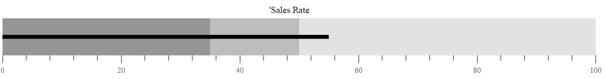
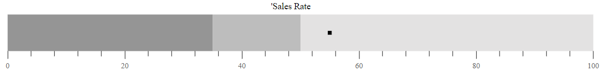
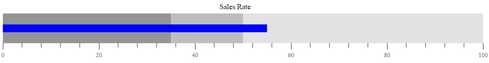

# Actual bar in Bullet Chart Control

To display the primary data or the current value of the data being measured known as the **Feature Measure** that should be encoded as a bar. This is called as the **Actual Bar** or the **Feature Bar** in the Bullet Chart, and to display the actual bar the [`ValueField`](https://help.syncfusion.com/cr/aspnetcore-js2/syncfusion.ej2.charts.bulletchart.html#Syncfusion_EJ2_Charts_BulletChart_ValueField) should be mapped to the appropriate field from the data source.






...
public class DefaultBulletData
{           
    public double value;
    public double target;
}



## Types of actual bar

The shape of the actual bar can be customized using the [`Type`](https://help.syncfusion.com/cr/aspnetcore-js2/syncfusion.ej2.charts.bulletchart.html#Syncfusion_EJ2_Charts_BulletChart_Type) property of the Bullet Chart. The actual bar contains `Rect` and `Dot` shapes. By default, the actual bar shape is Rect.






...
public class ActualBarTypeData
{           
    public double value;
    public double target;
}



## Actual bar customization

### Border customization

Using the [`ValueBorder`](https://help.syncfusion.com/cr/aspnetcore-js2/syncfusion.ej2.charts.bulletchart.html#Syncfusion_EJ2_Charts_BulletChart_ValueBorder) property of the bullet chart, you can customize the border [`Color`](https://help.syncfusion.com/cr/aspnetcore-js2/Syncfusion.EJ2.Charts.BulletChartBorder.html#Syncfusion_EJ2_Charts_BulletChartBorder_Color) and [`Width`](https://help.syncfusion.com/cr/aspnetcore-js2/Syncfusion.EJ2.Charts.BulletChartBorder.html#Syncfusion_EJ2_Charts_BulletChartBorder_Width) of the actual bar.






...
public class CustomBorderData
{           
    public double value;
    public double target;
}



### Fill color and height customization

Customize the fill color and height of the actual bar using the [`ValueFill`](https://help.syncfusion.com/cr/aspnetcore-js2/syncfusion.ej2.charts.bulletchart.html#Syncfusion_EJ2_Charts_BulletChart_ValueFill) and [`ValueHeight`](https://help.syncfusion.com/cr/aspnetcore-js2/syncfusion.ej2.charts.bulletchart.html#Syncfusion_EJ2_Charts_BulletChart_ValueHeight) properties of the bullet chart. Also, you can bind the color for the actual bar from [`DataSource`](https://help.syncfusion.com/cr/aspnetcore-js2/syncfusion.ej2.charts.bulletchart.html#Syncfusion_EJ2_Charts_BulletChart_DataSource) for the bullet chart using [`ValueFill`](https://help.syncfusion.com/cr/aspnetcore-js2/syncfusion.ej2.charts.bulletchart.html#Syncfusion_EJ2_Charts_BulletChart_ValueFill) property.






...
public class FillColorCustomization
{           
    public double value;
    public double target;
}



