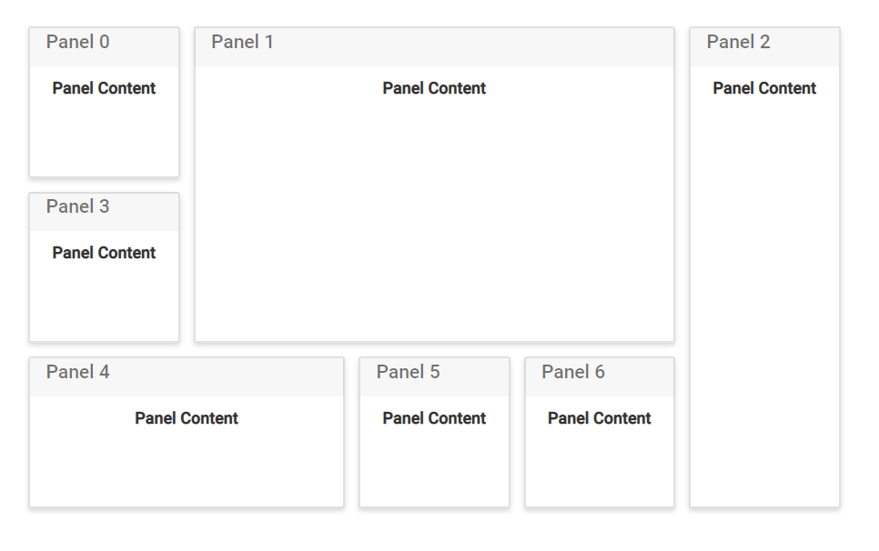
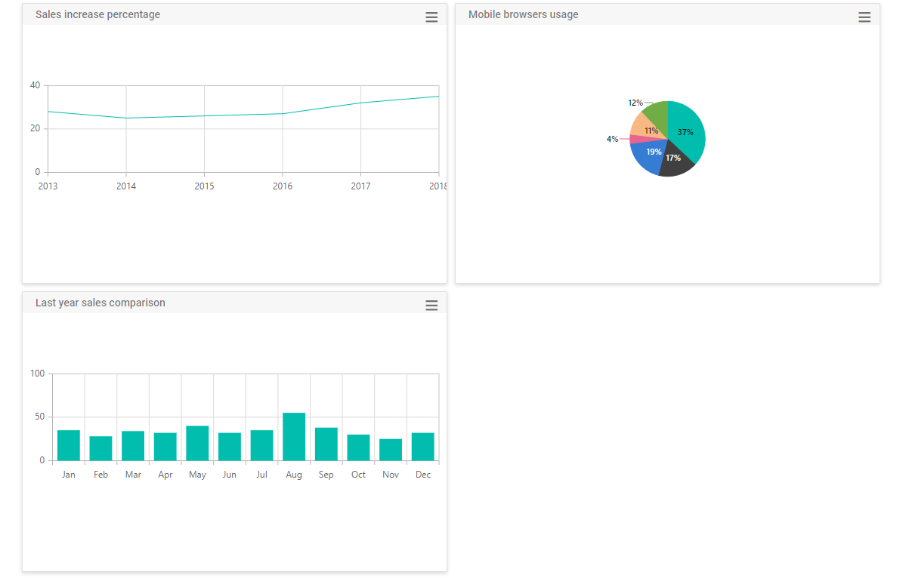

# Header and content of panels

The Dashboard Layout control is mostly used to represent the data used for monitoring or managing a process. These data or any HTML template can be placed as the [`content`](https://help.syncfusion.com/cr/cref_files/aspnetcore-js2/Syncfusion.EJ2~Syncfusion.EJ2.Layouts.DashboardLayoutPanel~Content.html) of a panel using the content property. Also, word or phrase that summarize the panel’s content can be added as the header on the top of each panel using the [`header`](https://help.syncfusion.com/cr/cref_files/aspnetcore-js2/Syncfusion.EJ2~Syncfusion.EJ2.Layouts.DashboardLayoutPanel~Header.html) property of the panel.










## Placing components as content

In a dashboard, controls like charts, grids, maps, gauges, and more can be used to present complex data. Such controls can be placed as the panel content by assigning the corresponding control element as the `content template` of the panel.

N> You must assign the empty div element inside the content template to add the control as content and also define the .e-panel, .e-panel-container, .e-panel-header, and .e-panel-content classes while rendering the DashboardLayout control using content template.

The following sample demonstrates how to add ej2-chart controls as the [`content`](https://help.syncfusion.com/cr/cref_files/aspnetcore-js2/Syncfusion.EJ2~Syncfusion.EJ2.Layouts.DashboardLayoutPanel~Content.html) for each panel in the DashboardLayout control.










N> You can refer to our [ASP.NET Core Dashboard Layout](https://www.syncfusion.com/aspnet-core-ui-controls/dashboard-layout) feature tour page for its groundbreaking feature representations. You can also explore our [ASP.NET Core Dashboard Layout example](https://ej2.syncfusion.com/aspnetcore/DashboardLayout/DefaultFunctionalities#/material) to knows how to present and manipulate data.