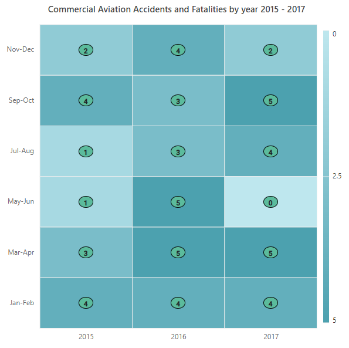

# Appearance in ASP.NET Core HeatMap Chart Component

## Cell customization

You can customize the cell by using the [cellSettings](https://help.syncfusion.com/cr/aspnetcore-js2/Syncfusion.EJ2~Syncfusion.EJ2.HeatMap.HeatMap~CellSettings.html) property.

### Border

Change the width, color, and radius of the heat map cells by using the [border](https://help.syncfusion.com/cr/aspnetcore-js2/Syncfusion.EJ2.HeatMap.HeatMapCellSettings.html#Syncfusion_EJ2_HeatMap_HeatMapCellSettings_Border) property.










### Cell highlighting

Enable or disable the cell highlighting while hovering over the heatmap cells by using the [enableCellHighlighting](https://help.syncfusion.com/cr/aspnetcore-js2/Syncfusion.EJ2.HeatMap.HeatMapCellSettings.html#Syncfusion_EJ2_HeatMap_HeatMapCellSettings_EnableCellHighlighting) property.

N> The cell highlighting only works in a SVG rendering mode.










### Color gradient mode

The [colorGradientMode](https://help.syncfusion.com/cr/aspnetcore-js2/Syncfusion.EJ2.HeatMap.ColorGradientMode.html) property can be used to set the minimum and maximum values for colors based on row and column. Three types of color gradient modes are available.

* **Table**: The minimum and maximum value colors calculated for overall data.
* **Row**: The minimum and maximum value colors calculated for each row of data.
* **Column**: The minimum and maximum value colors calculated for each column of data.

N> The default value of `ColorGradientMode` is **Table**.










## Background color

The background color of the HeatMap can be customized using the [backgroundColor](https://help.syncfusion.com/cr/aspnetcore-js2/Syncfusion.EJ2.HeatMap.HeatMap.html#Syncfusion_EJ2_HeatMap_HeatMap_Background) property.










## Margin

Set the margin for the heatmap from its container by using the [margin](https://help.syncfusion.com/cr/aspnetcore-js2/Syncfusion.EJ2.HeatMap.HeatMap.html#Syncfusion_EJ2_HeatMap_HeatMap_Margin) property.










## Title

The title is used to provide a quick information about the data plotted in heatmap. The [text](https://help.syncfusion.com/cr/aspnetcore-js2/Syncfusion.EJ2.HeatMap.HeatMapTitle.html#Syncfusion_EJ2_HeatMap_HeatMapTitle_Text) property is used to set the title for the heatmap. The text style of the title can be customized by using the [textStyle](https://help.syncfusion.com/cr/aspnetcore-js2/Syncfusion.EJ2.HeatMap.HeatMapTitle.html#Syncfusion_EJ2_HeatMap_HeatMapTitle_TextStyle) property.










## Data label

The visibility of data labels can be toggled using the [showLabel](https://help.syncfusion.com/cr/aspnetcore-js2/Syncfusion.EJ2.HeatMap.HeatMapCellSettings.html#Syncfusion_EJ2_HeatMap_HeatMapCellSettings_ShowLabel) property. By default, the data labels will be visible.










### Customize the data label

The label displayed in the HeatMap cell can be changed using the [cellRender](https://help.syncfusion.com/cr/aspnetcore-js2/Syncfusion.EJ2.HeatMap.HeatMap.html#Syncfusion_EJ2_HeatMap_HeatMap_CellRender) event.










### Text style

The text attributes of the data label such as font-family, font-size, and color can be customized using the [textStyle](https://help.syncfusion.com/cr/aspnetcore-js2/Syncfusion.EJ2.HeatMap.HeatMapCellSettings.html#Syncfusion_EJ2_HeatMap_HeatMapCellSettings_TextStyle) in the [cellSettings](https://help.syncfusion.com/cr/aspnetcore-js2/Syncfusion.EJ2~Syncfusion.EJ2.HeatMap.HeatMap~CellSettings.html) property.










### Format

The format of the data label, such as currency, decimal, percent etc. can be changed using [format](https://help.syncfusion.com/cr/aspnetcore-js2/Syncfusion.EJ2.HeatMap.HeatMapCellSettings.html#Syncfusion_EJ2_HeatMap_HeatMapCellSettings_Format) property.










### Template

Any HTML elements can be added as a template in the data labels by using the [labelTemplate](https://help.syncfusion.com/cr/aspnetcore-js2/Syncfusion.EJ2.HeatMap.HeatMapCellSettings.html#Syncfusion_EJ2_HeatMap_HeatMapCellSettings_LabelTemplate) property of [cellSettings](https://help.syncfusion.com/cr/aspnetcore-js2/Syncfusion.EJ2.HeatMap.HeatMapCellSettings.html) in the HeatMap.

The following examples show various data binding methods in the HeatMap using the `labelTemplate` property.

#### Array binding

By including `${value}` in the template content, the value from the data source for the corresponding cell can be displayed in the HeatMap cell as data label template content. Additionally, the x-axis and y-axis label values can be displayed by including `${xLabel}` and `${yLabel}` in the template content.

**Table**

The following example demonstrates how to add a data label template for array table binding.










**Cell**

The following example demonstrates how to add a data label template for array cell binding.










#### JSON binding

By including the desired field name in the template content, such as **${value}**, the value from the data source for the corresponding cell can be displayed in the HeatMap cell as data label template content.

**Table**

The following example demonstrates how to add a data label template for JSON table binding.










**Cell**

The following example demonstrates how to add a data label template for JSON cell binding.










