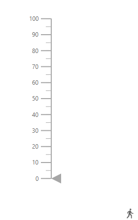
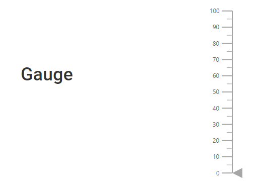
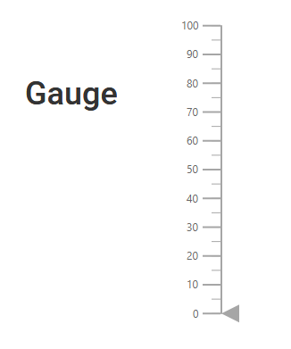
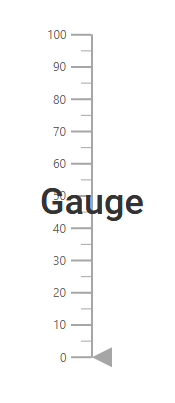
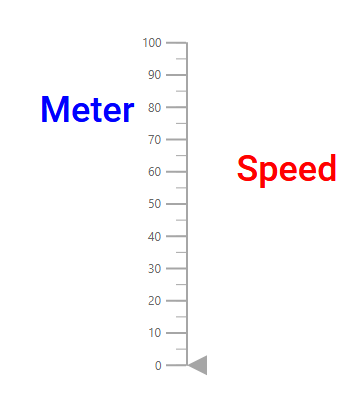

# Annotations in ASP.NET Core Linear Gauge

<!-- markdownlint-disable MD013 -->

Annotations are used to mark the specific area of interest in the Linear Gauge with text, HTML elements, or images. Any number of annotations can be added to the Linear Gauge component.

## Adding annotation

To render the custom HTML elements in the Linear Gauge component, use the [`Content`](https://help.syncfusion.com/cr/aspnetcore-js2/Syncfusion.EJ2.LinearGauge.LinearGaugeAnnotation.html#Syncfusion_EJ2_LinearGauge_LinearGaugeAnnotation_Content) property in the [`e-lineargauge-annotation`](https://help.syncfusion.com/cr/aspnetcore-js2/Syncfusion.EJ2.LinearGauge.LinearGaugeAnnotation.html). The annotation can be rendered either by specifying the id of the element or specifying the code to create a new element that needs to be displayed in the gauge area.

<!-- markdownlint-disable MD036 -->










## Customization

The following properties are used to customize the annotation.

* [`ZIndex`](https://help.syncfusion.com/cr/aspnetcore-js2/Syncfusion.EJ2.LinearGauge.LinearGaugeAnnotation.html#Syncfusion_EJ2_LinearGauge_LinearGaugeAnnotation_ZIndex) - Bring the annotation to the front or back, when annotation overlaps with another element.
* [`AxisValue`](https://help.syncfusion.com/cr/aspnetcore-js2/Syncfusion.EJ2.LinearGauge.LinearGaugeAnnotation.html#Syncfusion_EJ2_LinearGauge_LinearGaugeAnnotation_AxisValue) - To place the annotation in the specified axis value with respect to the provided axis index.
* [`AxisIndex`](https://help.syncfusion.com/cr/aspnetcore-js2/Syncfusion.EJ2.LinearGauge.LinearGaugeAnnotation.html#Syncfusion_EJ2_LinearGauge_LinearGaugeAnnotation_AxisIndex) - To place the annotation in the specified axis with respect to the provided axis value.
* [`HorizontalAlignment`](https://help.syncfusion.com/cr/aspnetcore-js2/Syncfusion.EJ2.LinearGauge.LinearGaugeAnnotation.html#Syncfusion_EJ2_LinearGauge_LinearGaugeAnnotation_HorizontalAlignment) - To place the annotation horizontally.
* [`VerticalAlignment`](https://help.syncfusion.com/cr/aspnetcore-js2/Syncfusion.EJ2.LinearGauge.LinearGaugeAnnotation.html#Syncfusion_EJ2_LinearGauge_LinearGaugeAnnotation_VerticalAlignment) - To place the annotation vertically.
* [`X`](https://help.syncfusion.com/cr/aspnetcore-js2/Syncfusion.EJ2.LinearGauge.LinearGaugeAnnotation.html#Syncfusion_EJ2_LinearGauge_LinearGaugeAnnotation_X), [`Y`](https://help.syncfusion.com/cr/aspnetcore-js2/Syncfusion.EJ2.LinearGauge.LinearGaugeAnnotation.html#Syncfusion_EJ2_LinearGauge_LinearGaugeAnnotation_Y) - To place the annotation in the specified location.

### Changing the z-index

To change the stack order of an annotation element, the [`ZIndex`](https://help.syncfusion.com/cr/aspnetcore-js2/Syncfusion.EJ2.LinearGauge.LinearGaugeAnnotation.html#Syncfusion_EJ2_LinearGauge_LinearGaugeAnnotation_ZIndex) property of the [`e-lineargauge-annotation`](https://help.syncfusion.com/cr/aspnetcore-js2/Syncfusion.EJ2.LinearGauge.LinearGaugeAnnotation.html) can be used.










### Positioning an annotation

The annotation can be placed anywhere in the Linear Gauge by setting the pixel value to the [`X`](https://help.syncfusion.com/cr/aspnetcore-js2/Syncfusion.EJ2.LinearGauge.LinearGaugeAnnotation.html#Syncfusion_EJ2_LinearGauge_LinearGaugeAnnotation_X) and [`Y`](https://help.syncfusion.com/cr/aspnetcore-js2/Syncfusion.EJ2.LinearGauge.LinearGaugeAnnotation.html#Syncfusion_EJ2_LinearGauge_LinearGaugeAnnotation_Y) properties in the [`e-lineargauge-annotation`](https://help.syncfusion.com/cr/aspnetcore-js2/Syncfusion.EJ2.LinearGauge.LinearGaugeAnnotation.html).










<!-- markdownlint-disable MD036 -->

### Alignment of annotation

The annotation can be aligned horizontally and vertically by using the [`HorizontalAlignment`](https://help.syncfusion.com/cr/aspnetcore-js2/Syncfusion.EJ2.LinearGauge.LinearGaugeAnnotation.html#Syncfusion_EJ2_LinearGauge_LinearGaugeAnnotation_HorizontalAlignment) and [`VerticalAlignment`](https://help.syncfusion.com/cr/aspnetcore-js2/Syncfusion.EJ2.LinearGauge.LinearGaugeAnnotation.html#Syncfusion_EJ2_LinearGauge_LinearGaugeAnnotation_VerticalAlignment) properties respectively. The possible values can be [**Center**](https://help.syncfusion.com/cr/aspnetcore-js2/Syncfusion.EJ2.LinearGauge.Placement.html#Syncfusion_EJ2_LinearGauge_Placement_Center), [**Far**](https://help.syncfusion.com/cr/aspnetcore-js2/Syncfusion.EJ2.LinearGauge.Placement.html#Syncfusion_EJ2_LinearGauge_Placement_Far), [**Near**](https://help.syncfusion.com/cr/aspnetcore-js2/Syncfusion.EJ2.LinearGauge.Placement.html#Syncfusion_EJ2_LinearGauge_Placement_Near), and [**None**](https://help.syncfusion.com/cr/aspnetcore-js2/Syncfusion.EJ2.LinearGauge.Placement.html#Syncfusion_EJ2_LinearGauge_Placement_None). The [`HorizontalAlignment`](https://help.syncfusion.com/cr/aspnetcore-js2/Syncfusion.EJ2.LinearGauge.LinearGaugeAnnotation.html#Syncfusion_EJ2_LinearGauge_LinearGaugeAnnotation_HorizontalAlignment) and [`VerticalAlignment`](https://help.syncfusion.com/cr/aspnetcore-js2/Syncfusion.EJ2.LinearGauge.LinearGaugeAnnotation.html#Syncfusion_EJ2_LinearGauge_LinearGaugeAnnotation_VerticalAlignment) properties are not applicable when the [`X`](https://help.syncfusion.com/cr/aspnetcore-js2/Syncfusion.EJ2.LinearGauge.LinearGaugeAnnotation.html#Syncfusion_EJ2_LinearGauge_LinearGaugeAnnotation_X) and [`Y`](https://help.syncfusion.com/cr/aspnetcore-js2/Syncfusion.EJ2.LinearGauge.LinearGaugeAnnotation.html#Syncfusion_EJ2_LinearGauge_LinearGaugeAnnotation_Y) properties are set in the [`e-lineargauge-annotation`](https://help.syncfusion.com/cr/aspnetcore-js2/Syncfusion.EJ2.LinearGauge.LinearGaugeAnnotation.html).










## Multiple annotations

Multiple annotations can be added to the Linear Gauge component by adding the multiple [`e-lineargauge-annotation`](https://help.syncfusion.com/cr/aspnetcore-js2/Syncfusion.EJ2.LinearGauge.LinearGaugeAnnotation.html) in the [`e-lineargauge-annotations`](https://help.syncfusion.com/cr/aspnetcore-js2/Syncfusion.EJ2.LinearGauge.LinearGaugeAnnotations.html) and customization for the annotation can be done with the [`e-lineargauge-annotation`](https://help.syncfusion.com/cr/aspnetcore-js2/Syncfusion.EJ2.LinearGauge.LinearGaugeAnnotation.html).










