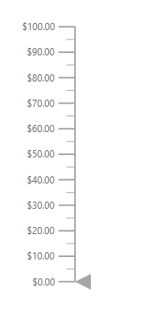

# Internationalization in ASP.NET Linear Gauge

Globalization is the process of designing and developing a component that works in different cultures. Internationalization is used to globalize the number content in Linear Gauge component using [`Format`](https://help.syncfusion.com/cr/aspnetcore-js2/Syncfusion.EJ2.LinearGauge.LinearGauge.html#Syncfusion_EJ2_LinearGauge_LinearGauge_Format) property in Linear Gauge. It has static text on some features such as

* Axis label
* Tooltip

The static text on above features can be changed to any culture such as Arabic, Deutsch and French. To know more about the globalization in ASP.NET Core components, refer [here](https://ej2.syncfusion.com/aspnetcore/documentation/common/localization/).

## Numeric Format

The text in axis labels and tooltip can be displayed in the numeric format such as currency, percentage and so on. To know more about the numeric formats in axis labels, refer [here](axis/#displaying-numeric-format-in-labels). In the below example, the axis label is displayed in the currency format.







