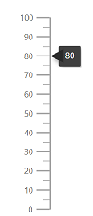
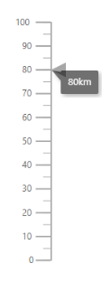
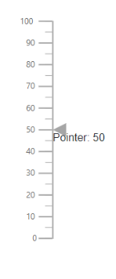
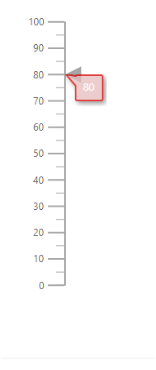
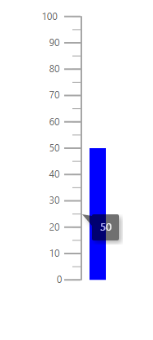
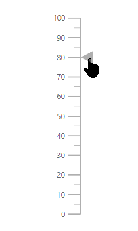

# User Interaction in ASP.NET Core Linear Gauge

## Tooltip

<!-- markdownlint-disable MD036 -->

Linear Gauge displays the details about a pointer value through [`e-lineargauge-tooltip`](https://help.syncfusion.com/cr/aspnetcore-js2/Syncfusion.EJ2.LinearGauge.LinearGaugeTooltipSettings.html), when the mouse hovers over the pointer. To enable the tooltip, set [`Enable`](https://help.syncfusion.com/cr/aspnetcore-js2/Syncfusion.EJ2.LinearGauge.LinearGaugeTooltipSettings.html#Syncfusion_EJ2_LinearGauge_LinearGaugeTooltipSettings_Enable) property as **true**.










<!-- markdownlint-disable MD013 -->

### Tooltip format

<!-- markdownlint-disable MD013 -->

Tooltip in the Linear Gauge control can be formatted using the [`Format`](https://help.syncfusion.com/cr/aspnetcore-js2/Syncfusion.EJ2.LinearGauge.LinearGaugeTooltipSettings.html#Syncfusion_EJ2_LinearGauge_LinearGaugeTooltipSettings_Format) property in [`e-lineargauge-tooltip`](https://help.syncfusion.com/cr/aspnetcore-js2/Syncfusion.EJ2.LinearGauge.LinearGaugeTooltipSettings.html). It is used to render the tooltip in certain format or to add a user-defined unit in the tooltip. By default, the tooltip shows the pointer value only. In addition to that, more information can be added in the tooltip. For example, the format **{value}km** shows pointer value with kilometer unit in the tooltip.










### Tooltip Template

The HTML element can be rendered in the tooltip of the Linear Gauge using the [`Template`](https://help.syncfusion.com/cr/aspnetcore-js2/Syncfusion.EJ2.LinearGauge.LinearGaugeTooltipSettings.html#Syncfusion_EJ2_LinearGauge_LinearGaugeTooltipSettings_Template) property in [`e-lineargauge-tooltip`](https://help.syncfusion.com/cr/aspnetcore-js2/Syncfusion.EJ2.LinearGauge.LinearGaugeTooltipSettings.html). The **${value}** can be used as placeholders in the HTML element to display the pointer values of the corresponding axis.










### Customize the appearance of the tooltip

The tooltip can be customized using the following properties in [`e-lineargauge-tooltip`](https://help.syncfusion.com/cr/aspnetcore-js2/Syncfusion.EJ2.LinearGauge.LinearGaugeTooltipSettings.html).

* [`Fill`](https://help.syncfusion.com/cr/aspnetcore-js2/Syncfusion.EJ2.LinearGauge.LinearGaugeTooltipSettings.html#Syncfusion_EJ2_LinearGauge_LinearGaugeTooltipSettings_Fill) - To fill the color for tooltip.
* [`EnableAnimtion`](https://help.syncfusion.com/cr/aspnetcore-js2/Syncfusion.EJ2.LinearGauge.LinearGaugeTooltipSettings.html#Syncfusion_EJ2_LinearGauge_LinearGaugeTooltipSettings_EnableAnimation) - To enable or disable the tooltip animation.
* [`Border`](https://help.syncfusion.com/cr/aspnetcore-js2/Syncfusion.EJ2.LinearGauge.LinearGaugeTooltipSettings.html#Syncfusion_EJ2_LinearGauge_LinearGaugeTooltipSettings_Border) - To set the border color and width of the tooltip.
* [`TextStyle`](https://help.syncfusion.com/cr/aspnetcore-js2/Syncfusion.EJ2.LinearGauge.LinearGaugeTooltipSettings.html#Syncfusion_EJ2_LinearGauge_LinearGaugeTooltipSettings_TextStyle) - To customize the style of the text in tooltip.
* [`ShowAtMousePosition`](https://help.syncfusion.com/cr/aspnetcore-js2/Syncfusion.EJ2.LinearGauge.LinearGaugeTooltipSettings.html#Syncfusion_EJ2_LinearGauge_LinearGaugeTooltipSettings_ShowAtMousePosition) - To show the tooltip at the mouse position.










## Positioning the tooltip

The tooltip is positioned at the [**End**](https://help.syncfusion.com/cr/aspnetcore-js2/Syncfusion.EJ2.LinearGauge.TooltipPosition.html#Syncfusion_EJ2_LinearGauge_TooltipPosition_End) of the pointer. To change the position of the tooltip at the start, or center of the pointer, set the [`Position`](https://help.syncfusion.com/cr/aspnetcore-js2/Syncfusion.EJ2.LinearGauge.LinearGaugeTooltipSettings.html#Syncfusion_EJ2_LinearGauge_LinearGaugeTooltipSettings_Position) property to [**Start**](https://help.syncfusion.com/cr/aspnetcore-js2/Syncfusion.EJ2.LinearGauge.TooltipPosition.html#Syncfusion_EJ2_LinearGauge_TooltipPosition_Start) or [**Center**](https://help.syncfusion.com/cr/aspnetcore-js2/Syncfusion.EJ2.LinearGauge.TooltipPosition.html#Syncfusion_EJ2_LinearGauge_TooltipPosition_Center).










## Pointer Drag

To drag either marker or bar pointer to the desired axis value, set the [`EnableDrag`](https://help.syncfusion.com/cr/aspnetcore-js2/Syncfusion.EJ2.LinearGauge.LinearGaugePointer.html#Syncfusion_EJ2_LinearGauge_LinearGaugePointer_EnableDrag) property as **true** in [`e-lineargauge-pointer`](https://help.syncfusion.com/cr/aspnetcore-js2/Syncfusion.EJ2.LinearGauge.LinearGaugePointer.html).










