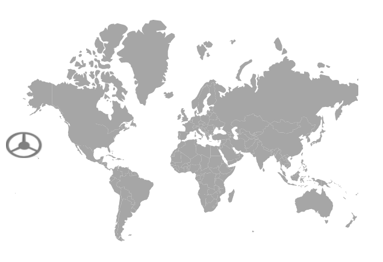
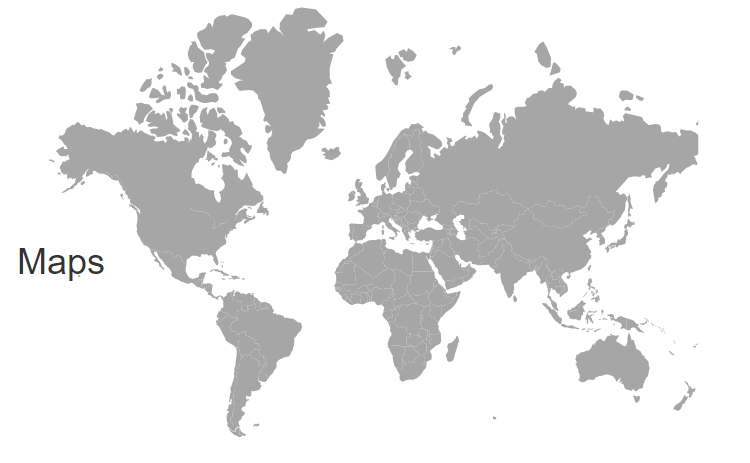
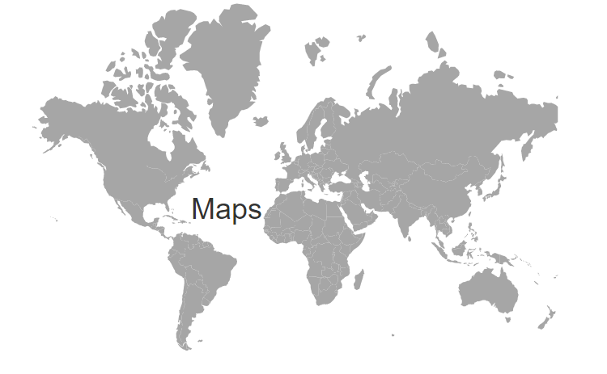
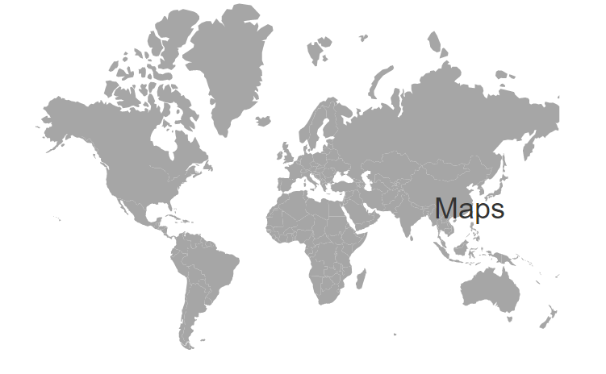
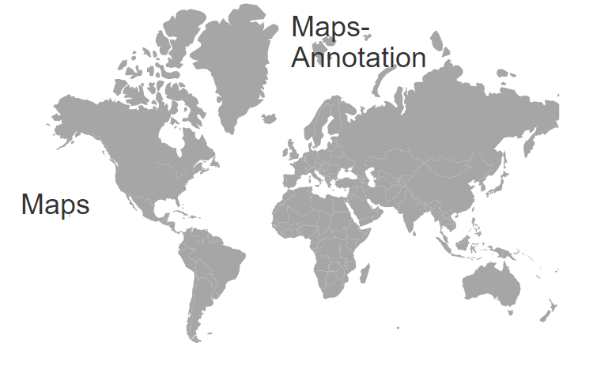

# Annotations in ASP.NET Core Maps Component

<!-- markdownlint-disable MD013 -->

Annotations are used to mark the specific area of interest in the Maps with texts, shapes, or images. Any number of annotations can be added to the Maps component.

## Annotation

By using the `Content` property of `MapsAnnotation`, text content or id of an element or an HTML string can be specified to render a new HTML element in Maps.










## Annotation customization

### Changing the z-index

The stack order of an annotation element can be changed using the `ZIndex` property in the `MapsAnnotation`.










### Positioning an annotation

Annotations can be placed anywhere in the Maps by specifying pixel or percentage values to the `X` and `Y` properties in the `MapsAnnotation`.










### Alignment of an annotation

Annotations can be aligned using the `HorizontalAlignment` and `VerticalAlignment` properties in the `MapsAnnotation`. The possible values can be **Center**, **Far**, **Near** and **None**.










## Multiple Annotation

Multiple annotations can be added to the Maps by adding Multiple `MapsAnnotation` in the `MapsAnnotations` and customization for the annotations can be done with the `MapsAnnotation`.










