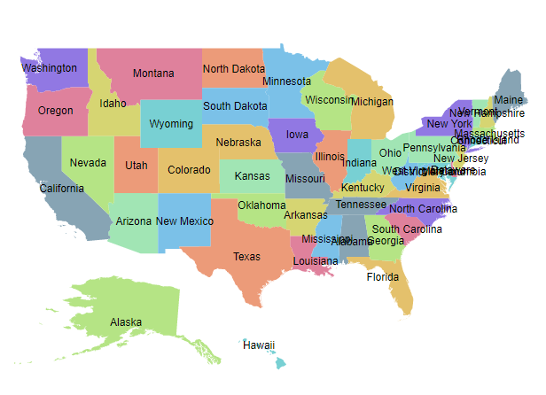
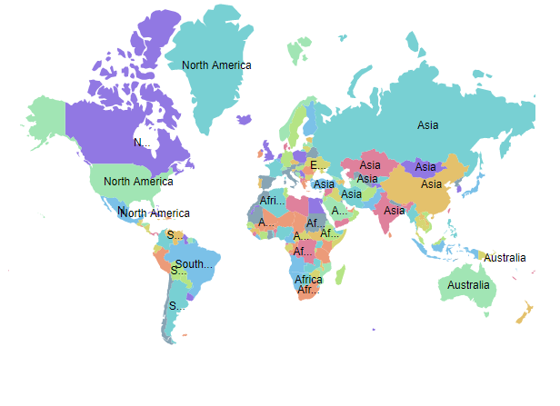
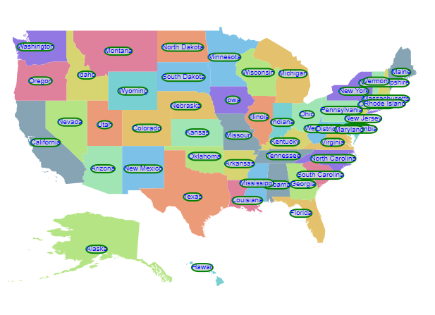
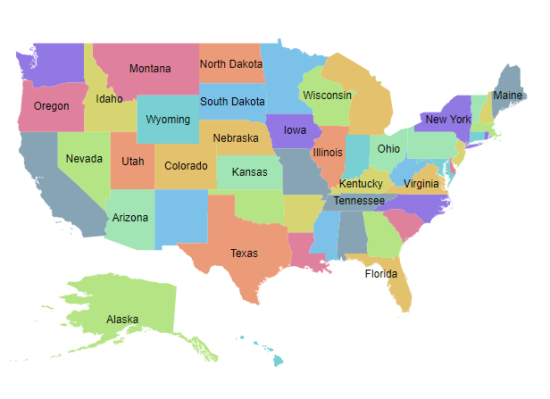
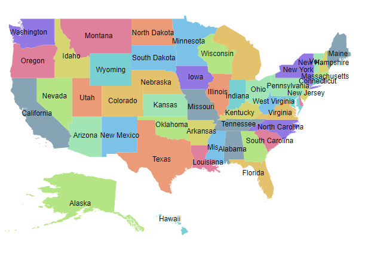
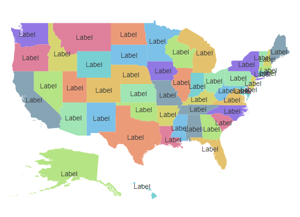

# Data labels in ASP.NET Core Maps Component

Data labels provide information to users about the shapes of the Maps component. It can be enabled by setting the `Visible` property of the `MapsDataLabelSettings` to **true**.

## Adding data labels

To display data labels in the Maps, the `LabelPath` property of `MapsDataLabelSettings` must be used. The value of the `LabelPath` property can be taken from the field name in the shape data or data source. In the following example, the value of the `LabelPath` property is the field name in the shape data of the Maps layer.










In the following example, the value of `LabelPath` property is set from the field name in the data source of the layer settings.










## Customization

The following properties are available in the `MapsDataLabelSettings` to customize the data label of the Maps component.

* `Border` - To customize the color, width and opacity for the border of the data labels in Maps.
* `Fill` - To apply the color of the data labels in Maps.
* `Opacity` - To customize the transparency of the data labels in Maps.
* `TextStyle` - To customize the text style of the data labels in Maps.










## Label animation

The data labels can be animated during the initial rendering of the Maps. This can be enabled by setting the [animationDuration](https://help.syncfusion.com/cr/aspnetcore-js2/Syncfusion.EJ2.Maps.MapsDataLabelSettings.html#Syncfusion_EJ2_Maps_MapsDataLabelSettings_AnimationDuration) property in the `dataLabelSettings` of the Maps. The duration of the animation is specified in milliseconds.










## Smart labels

The Maps component provides an option to handle the labels when they intersect with the corresponding shape borders using the `SmartLabelMode` property. The following options are available in the `SmartLabelMode` property.

* None
* Hide
* Trim










## Intersect action

The Maps component provides an option to handle the labels when a label intersects with another label using the `IntersectionAction` property. The following options are available in the `IntersectionAction` property.

* None
* Hide
* Trim










## Adding data label as a template

The data label can be added as a template in the Maps component. The `Template` property of `MapsDataLabelSettings` is used to set the data label as a template. Any text or HTML element can be added as the template in data labels.

N>The properties of data label such as, `SmartLabelMode` , `IntersectionAction`, `AnimationDuration`, `Border`, `Fill`, `Opacity` and `TextStyle` properties are not applicable to `Template` property. The styles can be applied to the label template using the CSS styles of the HTML element.










