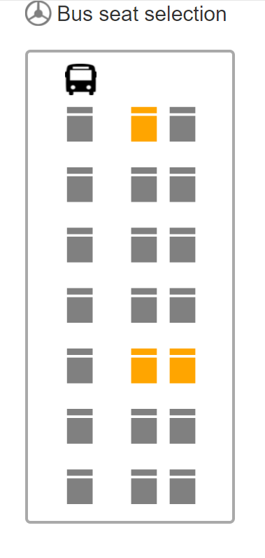

# Custom path map in ASP.NET Core Maps Component

Maps component can be customized as the desired layout using the custom path map feature. Here, the Maps component has been showcased with normal geometry type shapes to represent the bus seat selection layout.










Note: Refer the data values for custom shapes(https://www.syncfusion.com/downloads/support/directtrac/general/ze/seat902454209) here.

