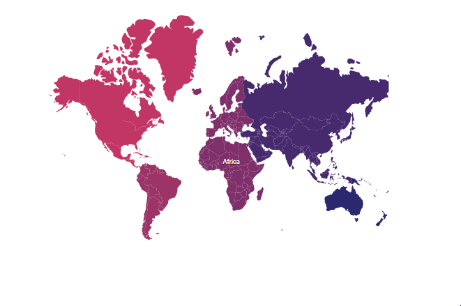

# Drill-down in ASP.NET Core Maps Component

By clicking a continent, all the countries available in that continent can be viewed using the drill-down feature. For example, the countries in the `Africa` continent have been showcased here. To showcase all the countries in `Africa` continent by clicking the `ShapeSelected` event as mentioned in the following example.










Note: Refer the data values for WorldMap(https://www.syncfusion.com/downloads/support/directtrac/general/ze/WorldMap-1118251150) and Africa(https://www.syncfusion.com/downloads/support/directtrac/general/ze/Africa1913669070) shapes here.

