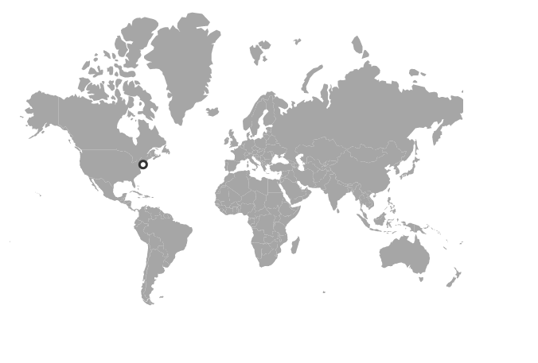
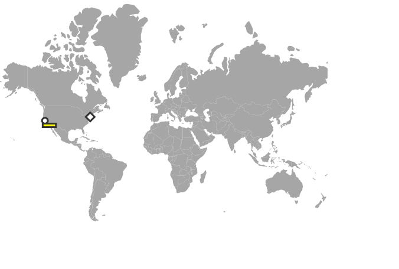

# Marker types in ASP.NET Core Maps Component

## Add different types of markers

Different marker objects can be added to the Maps component using the marker settings. To update different marker settings in Maps, follow the given steps.

**Step 1**:

Initialize the Maps component with marker settings. Here, a marker has been added with specified latitude and longitude of California by using the `DataSource` property. To customize the shape of the marker using the `Shape` property and change the border color and width of the marker using the `Border` property as mentioned in the following example.










**Step 2**:

Customize the above option for n number of markers as mentioned in the following example.










