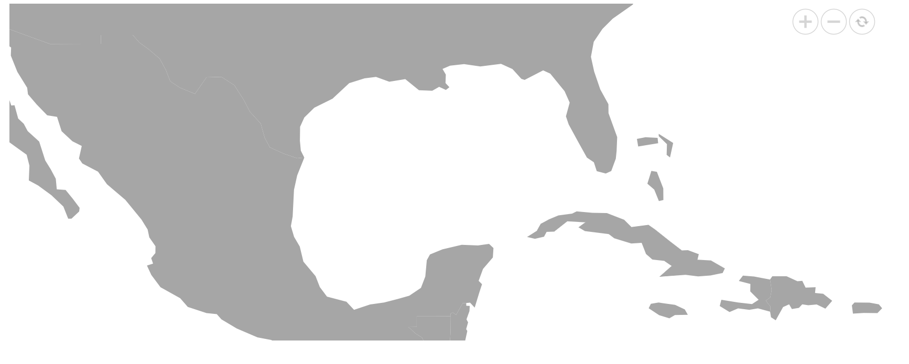

# Center position zooming

The center position zooming can be achieved by using the `MapsCenterPosition` class and `ZoomFactor` property as mentioned in the following example. The center position is used to configure the zoom level of Maps, and the zoom factor is used to specify the center position where the Maps should be displayed.










