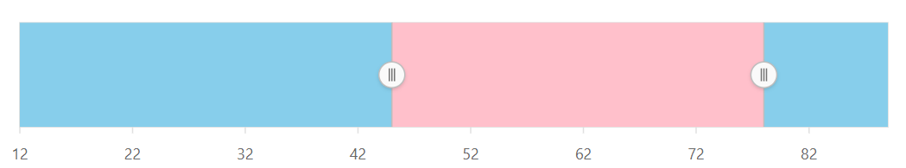
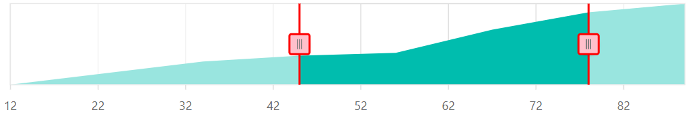
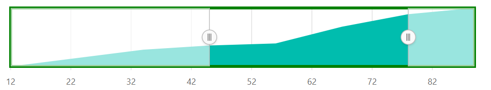

# Customization

## Navigator appearance

The Range Selector can be customized by using the `navigatorStyleSettings`. The `selectedRegionColor` property is used to specify the color for the selected region, whereas the `unselectedRegionColor` property is used to specify the color for the unselected region.










## Thumb

The thumb property allows to customize the border, fill color, size, and type of thumb. Thumbs can be of two shapes: **Circle** and **Rectangle**.










## Border customization

Using the `navigatorBorder`, the `width` and `color` of the Range Selector border can be customized.










## Deferred update

If the `enableDeferredUpdate` property is set to **true**, then the changed event will be triggered after dragging the slider. If the `enableDeferredUpdate` is **false**, then the changed event will be triggered when dragging the slider. By default, the `enableDeferredUpdate` is set to **false**.










## Allow snapping

The `allowSnapping` property toggles the placement of the slider exactly to the left or on the nearest interval.










## Animation

The speed of the animation can be controlled using the `animationDuration` property. The default value of the `animationDuration` property is **500** milliseconds.










## See Also

* [Grid and Tick Lines](./grid-tick/)
* [Labels](./labels/)