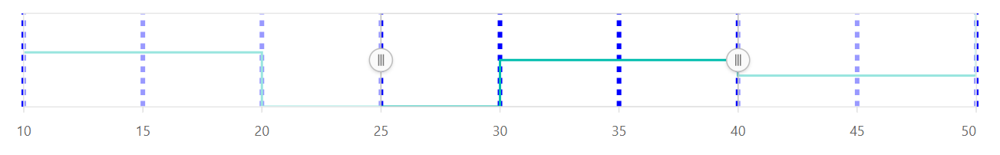
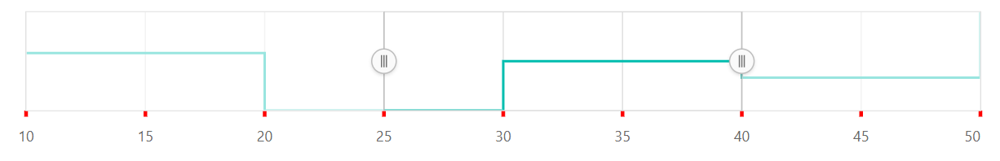

# Grid and Tick Lines

## Grid line customization

The gridlines indicate axis divisions by drawing the chart plot. Gridlines include helpful cues to the user, particularly for large or complicated charts. The `width`, `color`, and `dashArray` of the major gridlines can be customized by using the `majorGridLines` setting.










## Tick line customization

Ticklines are the small lines which is drawn on the axis line representing the axis labels. Ticklines will be drawn outside the axis by default. The `width`, `color`, and `dashArray` of the major ticklines can be customized by using the `majorTickLines` setting.










