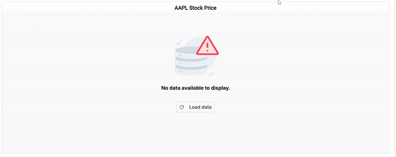

<!-- markdownlint-disable MD036 -->

# Working with Data

Chart can visualise data bound from local or remote data.

## Local Data

You can bind a simple JSON data to the chart using [`dataSource`](https://help.syncfusion.com/cr/aspnetcore-js2/Syncfusion.EJ2.Charts.StockChartStockChartSeries.html#Syncfusion_EJ2_Charts_StockChartStockChartSeries_DataSource) property in series.










## Handling No Data

When no data is available to render in the stock chart, the `noDataTemplate` property can be used to display a custom layout within the chart area. This layout may include a message indicating the absence of data, a relevant image, or a button to initiate data loading. Styled text, images, or interactive elements can be incorporated to maintain design consistency and improve user guidance. Once data becomes available, the chart automatically updates to display the appropriate visualization.










## See Also

* [Series Types](./series-types/)
