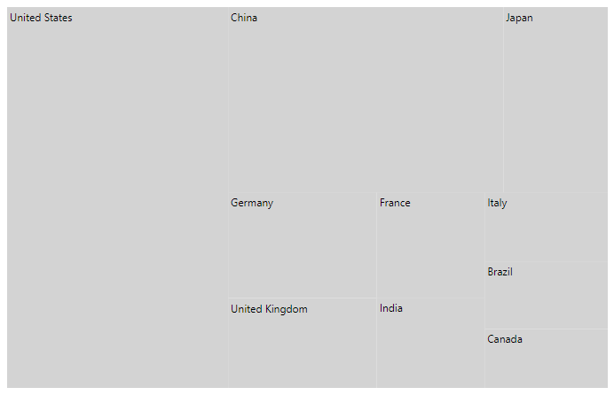
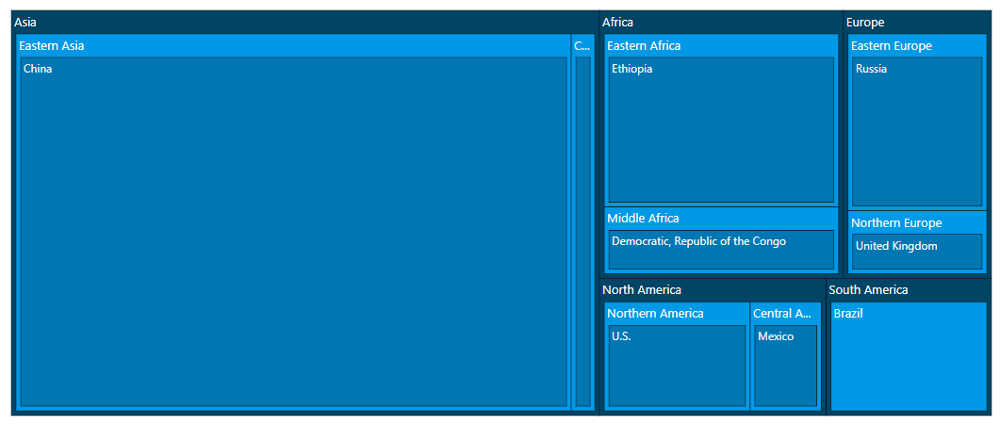

# Data Binding

The TreeMap control supports data binding using the dataSource property.

## Populate data

The `dataSource` property accepts collection values as input. For example, a list of objects can be provided as input. Data can be given as either flat or hierarchical collection to the `dataSource` property.

<!-- markdownlint-disable MD036 -->

### Flat collection

The following code shows, how to bind a flat collection as data source to the TreeMap control.
























### Hierarchical collection

The following code shows, how to bind a hierarchical collection as data source to the TreeMap control.

<!-- markdownlint-disable MD010 -->
























