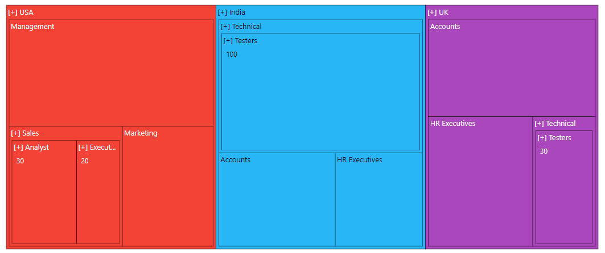

# Drill-down

The TreeMap supports drill-down to expose the hierarchy, achieved by clicking a node. If an item is clicked in the TreeMap, it will be moved to the next level or sub level hierarchy and returned back to the previous level by clicking the node.

## Perform drill-down action

The TreeMap items can be drilled by setting the `enableDrillDown` property to **true**.










## On-demand data loading

All the child items are rendered during the normal drill-down process, and visible at the initial rendering of the TreeMap. But on-demand data loading, it will not render child items at initial rendering, and child nodes will be rendered during the drill-down process by setting the `drillDownView` property to **true**.










## Breadcrumb support

TreeMap items are drilled, up to any level of parent using breadcrumb navigation and the level from root parent to current level is displayed at the top of item layout. It can be enabled by using the `enableBreadcrumb` property to **true** and customize the breadcrumb connector using the `breadcrumbConnector` property. By default, **-**(hyphen) is the connector.










