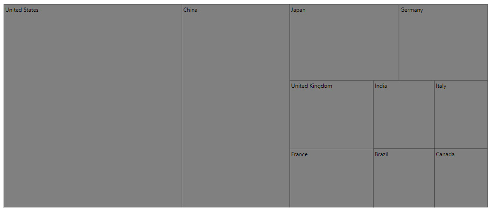
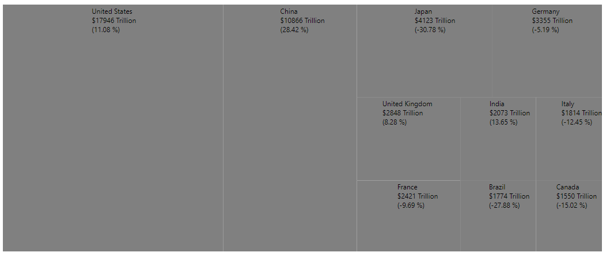
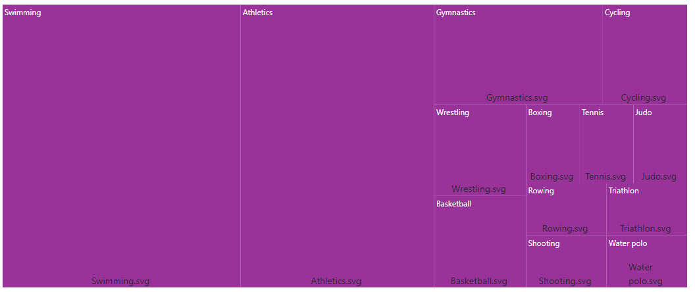
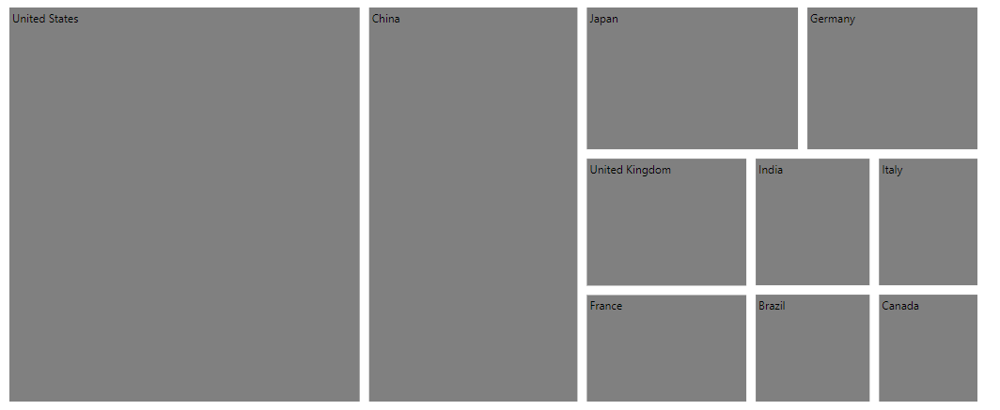

# Leaf Item

A leaf item defines a visualized data element and does not contain child nodes but contains parent node if the levels are specified in the TreeMap.

## Leaf label

Label is represented by item name or value. Label will be appeared by specifying the `labelPath` property and customize the label style using the `labelStyle` property.
























<!-- markdownlint-disable MD036 -->

### Label position and format

Positioning the leaf item label using the `labelPosition` property and the text format can be customized by specifying data source properties name in the `labelFormat` property.
























<!-- markdownlint-disable MD036 -->

### Label template and position

Specifies the template of leaf item label and position of the template to be customized using `labelTemplate` and `templatePosition` properties.
























<!-- markdownlint-disable MD036 -->

## Item gap

The `gap` property is used to separate an item from another item. Each item rectangle is split into equal space with specified gap.
























