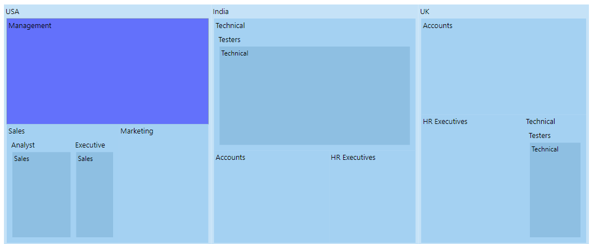
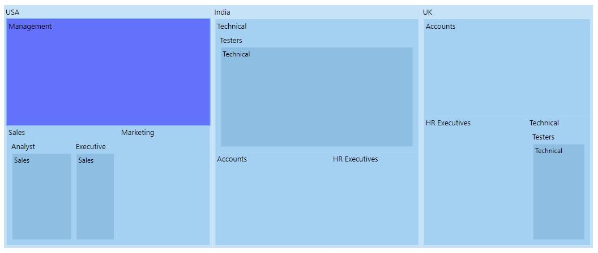

# Selection and Highlight

## Selection

Selection is used to select a particular group or item to differentiate from other items. Each item or each group can be selected and deselected while interacting with the items. The corresponding Treemap items are also selected while tapping a specific legend item, and vice versa. 

The `fill` property is used to change the selected item color. The `color` and the `width` properties are used to customize the selected item border, and the selection is enabled by using the `enable` property  to **true** in the `selectionSettings`.










## Highlight

Highlight is used to highlight an item or group from other items or groups. Each item or each group can be highlighted by hovering the mouse over the items. The corresponding Treemap items are also be highlighted while hovering over a specific legend item, and vice versa. 

The `fill` property is used to change the highlighted item color. The `color` and the `width` properties are used to customize the highlighted item border, and the highlight is enabled by setting the `enable` property to **true** in the `highlightSettings`.










