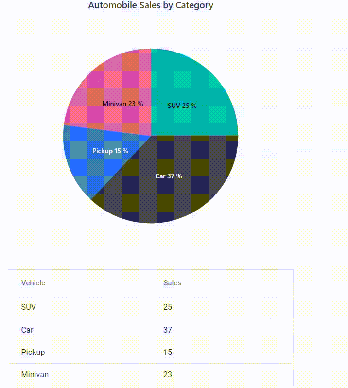

# Pie & Doughnut in ASP.NET MVC Accumulation Chart Component

## Pie Chart

To render a pie series, use the series [`Type`](https://help.syncfusion.com/cr/aspnetcore-js2/Syncfusion.EJ2.Charts.AccumulationSeries.html#Syncfusion_EJ2_Charts_AccumulationSeries_Type) as `Pie`.










## Radius Customization

By default, radius of the pie series will be 80% of the size (minimum of chart width and height). You can customize this using [`Radius`](https://help.syncfusion.com/cr/aspnetcore-js2/Syncfusion.EJ2.Charts.AccumulationSeries.html#Syncfusion_EJ2_Charts_AccumulationSeries_Radius) property of the series.










## Pie Center

The center position of the pie can be changed by Center X and Center Y. By default, center value of the pie series x and y is 50%. You can customize this using [`Center`](https://help.syncfusion.com/cr/aspnetcore-js2/Syncfusion.EJ2.Charts.AccumulationChart.html#Syncfusion_EJ2_Charts_AccumulationChart_Center) property of the series.










## Various Radius Pie Chart

You can use radius mapping to render the slice with different [`Radius`](https://help.syncfusion.com/cr/aspnetcore-js2/Syncfusion.EJ2.Charts.AccumulationSeries.html#Syncfusion_EJ2_Charts_AccumulationSeries_Radius) pie and also use [`Border`](https://help.syncfusion.com/cr/aspnetcore-js2/Syncfusion.EJ2.Charts.AccumulationSeries.html#Syncfusion_EJ2_Charts_AccumulationSeries_Border) , fill properties to customize the point. dataLabel is used to represent individual data and its value.










## Doughnut Chart

To achieve a doughnut in pie series, customize the [`InnerRadius`](https://help.syncfusion.com/cr/aspnetcore-js2/Syncfusion.EJ2.Charts.AccumulationSeries.html#Syncfusion_EJ2_Charts_AccumulationSeries_InnerRadius) property of the series. By setting value greater than 0%, a doughnut will appear. The `InnerRadius` property takes value from 0% to 100% of the pie radius.










## Multiple Doughnut Series

You can create multiple doughnut within a single chart by adding multiple series with different [`InnerRadius`](https://help.syncfusion.com/cr/aspnetmvc-js2/Syncfusion.EJ2.Charts.AccumulationSeries.html#Syncfusion_EJ2_Charts_AccumulationSeries_InnerRadius) and [`Radius`](https://help.syncfusion.com/cr/aspnetmvc-js2/Syncfusion.EJ2.Charts.AccumulationSeries.html#Syncfusion_EJ2_Charts_AccumulationSeries_Radius) values. This allows you to compare multiple data sets with the same categories. Each series can have different data, colors, and customizations. You can also use the [`MappingKey`](https://help.syncfusion.com/cr/aspnetmvc-js2/Syncfusion.EJ2.Charts.AccumulationChartLegendSettings.html#Syncfusion_EJ2_Charts_AccumulationChartLegendSettings_MappingKey) property in `LegendSettings` to map the legend items based on the specified field from the data source. When set, points with matching `MappingKey` values are grouped into a single legend item.










## Start and End angles

You can customize the start and end angle of the pie series using the [`StartAngle`](https://help.syncfusion.com/cr/aspnetcore-js2/Syncfusion.EJ2.Charts.AccumulationSeries.html#Syncfusion_EJ2_Charts_AccumulationSeries_StartAngle) and [`EndAngle`](https://help.syncfusion.com/cr/aspnetcore-js2/Syncfusion.EJ2.Charts.AccumulationSeries.html#Syncfusion_EJ2_Charts_AccumulationSeries_EndAngle) properties. The default value of `StartAngle` is 0 degree, and `EndAngle` is 360 degrees. By customizing this, you can achieve a semi pie series.










## Color & Text Mapping

The fill color and the text in the data source can be mapped to the chart using `PointColorMapping` in series and `Name` in datalabel respectively.










## Border radius

You can create rounded corners for each slice by using the `BorderRadius` option, which gives the chart a modern and polished appearance.










## Customization

Individual points can be customized using the `PointRender` event.










## Patterns

You can apply different patterns to the pie slices using the `ApplyPattern` property in the series and the [`PointRender`](https://help.syncfusion.com/cr/aspnetmvc-js2/Syncfusion.EJ2.Charts.AccumulationChart.html#Syncfusion_EJ2_Charts_AccumulationChart_PointRender) event.










## Hide pie or doughnut border

By default, the border will appear in the pie/doughnut chart while mouse hover on the chart. You can disable the the border by setting `EnableBorderOnMouseMove` property is `false`.










## Color Palette

You can customize the color the of the point using the `Palettes` property.










## Multi-level pie chart

You can achieve a multi-level drill down in pie and doughnut charts using [PointClick](https://help.syncfusion.com/cr/aspnetmvc-js2/Syncfusion.EJ2.Charts.AccumulationChart.html#Syncfusion_EJ2_Charts_AccumulationChart_PointClick) event. If user clicks any point in the chart, that corresponding data will be shown in the next level and so on based on point clicked.

You can also achieve drill-up (back to the initial state) by using [ChartMouseClick](https://help.syncfusion.com/cr/aspnetmvc-js2/Syncfusion.EJ2.Charts.AccumulationChart.html#Syncfusion_EJ2_Charts_AccumulationChart_ChartMouseClick) event. In below sample, you can drill-up by clicking back button in the center of the char










## See Also

* [Data label](./data-label)
* [Grouping](./grouping)
