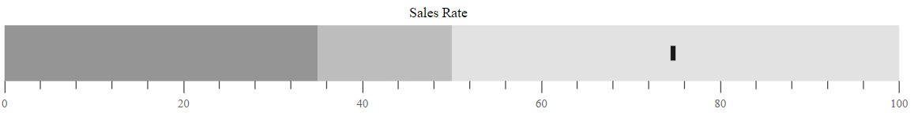
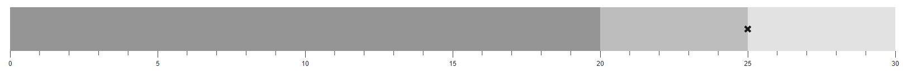

# Target bar

The line marker that runs perpendicular to the orientation of the graph is known as the **Comparative Measure** and it is used as a target marker to compare against the feature measure value. This is also called as the **Target Bar** in the Bullet Chart. To display the target bar, the [`TargetField`](https://help.syncfusion.com/cr/aspnetmvc-js2/syncfusion.ej2.charts.bulletchart.html#Syncfusion_EJ2_Charts_BulletChart_TargetField) should be mapped to the appropriate field from the datasource.










## Types of target bar

The shape of the target bar can be customized using the [`TargetTypes`](https://help.syncfusion.com/cr/aspnetmvc-js2/syncfusion.ej2.charts.bulletchart.html#Syncfusion_EJ2_Charts_BulletChart_TargetTypes) property and it supports **Circle**, **Cross**, and **Rect** shapes. The default type of the target bar is **Rect**.










## Target bar customization

The following properties can be used to customize the target bar. Also, you can bind the color for the target bar from [`DataSource`](https://help.syncfusion.com/cr/aspnetmvc-js2/syncfusion.ej2.charts.bulletchart.html#Syncfusion_EJ2_Charts_BulletChart_DataSource) for the bullet chart.

* [`TargetColor`](https://help.syncfusion.com/cr/aspnetmvc-js2/syncfusion.ej2.charts.bulletchart.html#Syncfusion_EJ2_Charts_BulletChart_TargetColor) - Specifies the fill color of target bar.
* [`TargetWidth`](https://help.syncfusion.com/cr/aspnetmvc-js2/syncfusion.ej2.charts.bulletchart.html#Syncfusion_EJ2_Charts_BulletChart_TargetWidth) - Specifies the width of target bar.










