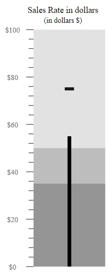
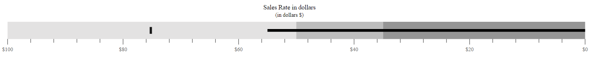
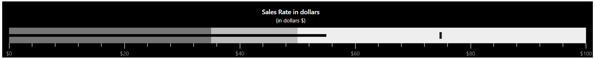

# Customization

## Orientation

The Bullet Chart can be rendered in different orientations such as **Horizontal** or **Vertical** via the [`Orientation`](https://help.syncfusion.com/cr/aspnetmvc-js2/Syncfusion.EJ2.Charts.BulletChart.html#Syncfusion_EJ2_Charts_BulletChart_Orientation) property. By default, the Bullet Chart is rendered in the **Horizontal** orientation.










## Right-to-left (RTL)

The Bullet Chart supports the right-to-left rendering that can be enabled by setting the [`EnableRtl`](https://help.syncfusion.com/cr/aspnetmvc-js2/Syncfusion.EJ2.Charts.BulletChart.html#Syncfusion_EJ2_Charts_BulletChart_EnableRtl) property to **true**.










## Animation

The actual and the target bar supports the linear animation via the [`Animation`](https://help.syncfusion.com/cr/aspnetmvc-js2/Syncfusion.EJ2.Charts.BulletChart.html#Syncfusion_EJ2_Charts_BulletChart_Animation) setting. The speed and the delay are controlled using the [`Duration`](https://help.syncfusion.com/cr/aspnetmvc-js2/Syncfusion.EJ2.Charts.BulletChartAnimation.html#Syncfusion_EJ2_Charts_BulletChartAnimation_Duration) and [`Delay`](https://help.syncfusion.com/cr/aspnetmvc-js2/Syncfusion.EJ2.Charts.BulletChartAnimation.html#Syncfusion_EJ2_Charts_BulletChartAnimation_Delay) properties respectively.










## Theme

The Bullet Chart supports different type of themes via the [`Theme`](https://help.syncfusion.com/cr/aspnetmvc-js2/Syncfusion.EJ2.Charts.BulletChart.html#Syncfusion_EJ2_Charts_BulletChart_Theme) property.










