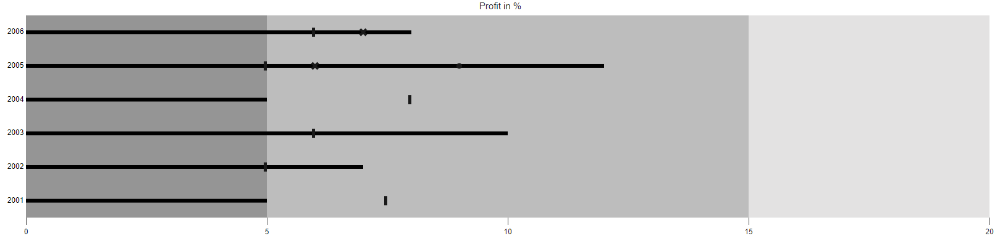

# Working with data

Bullet Chart can visualise data bound from local or remote data.

## Local data

You can bind a simple JSON data to the chart using [`DataSource`](https://help.syncfusion.com/cr/aspnetmvc-js2/Syncfusion.EJ2.Charts.BulletChart.html#Syncfusion_EJ2_Charts_BulletChart_DataSource) direct property of the bullet-chart. Now, map the fields in JSON to [`ValueField`](https://help.syncfusion.com/cr/aspnetmvc-js2/Syncfusion.EJ2.Charts.BulletChart.html#Syncfusion_EJ2_Charts_BulletChart_ValueField) and [`TargetField`](https://help.syncfusion.com/cr/aspnetmvc-js2/Syncfusion.EJ2.Charts.BulletChart.html#Syncfusion_EJ2_Charts_BulletChart_TargetField) properties. The [`DataSource`](https://help.syncfusion.com/cr/aspnetmvc-js2/Syncfusion.EJ2.Charts.BulletChart.html#Syncfusion_EJ2_Charts_BulletChart_DataSource) property accepts a collection of values as input that helps to display measures, and compares them to a target bar. To display the actual and target bar, specify the property from the datasource into the [`ValueField`](https://help.syncfusion.com/cr/aspnetmvc-js2/Syncfusion.EJ2.Charts.BulletChart.html#Syncfusion_EJ2_Charts_BulletChart_ValueField) and [`TargetField`](https://help.syncfusion.com/cr/aspnetmvc-js2/Syncfusion.EJ2.Charts.BulletChart.html#Syncfusion_EJ2_Charts_BulletChart_TargetField) respectively.










