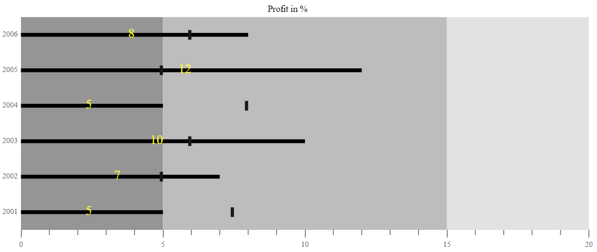

# Data label

Data Labels are used to identify the value of actual bar in the Bullet Chart component. The Data Labels will be shown by specifying the [`DataLabel`](https://help.syncfusion.com/cr/aspnetmvc-js2/Syncfusion.EJ2.Charts.BulletChart.html#Syncfusion_EJ2_Charts_BulletChart_DataLabel) setting's [`Enable`](https://help.syncfusion.com/cr/aspnetmvc-js2/Syncfusion.EJ2.Charts.BulletChartBulletDataLabel.html#Syncfusion_EJ2_Charts_BulletChartBulletDataLabel_Enable) property to **true**.










## Data label customization

Data Labels color, opacity, font size, font family, font weight, and font style can be customized using the [`LabelStyle`](https://help.syncfusion.com/cr/aspnetmvc-js2/Syncfusion.EJ2.Charts.BulletChartBulletDataLabel.html#Syncfusion_EJ2_Charts_BulletChartBulletDataLabel_LabelStyle).










