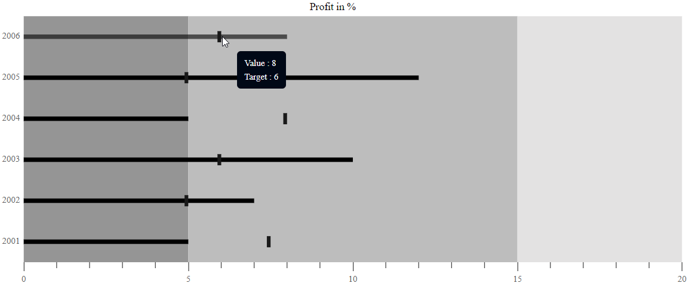

# Tooltip

When the mouse is hovered over a bar in the Bullet Chart, the tooltip displays important summary about the actual and the target bar values.

## Default tooltip

By setting [`Enable`](https://help.syncfusion.com/cr/aspnetmvc-js2/Syncfusion.EJ2.Charts.BulletChartBulletTooltipSettings.html#Syncfusion_EJ2_Charts_BulletChartBulletTooltipSettings_Enable)property to true. By default tooltip is visible in bullet-chart. The tooltip is not visible by default. To make it visible, set the [`Enable`](https://help.syncfusion.com/cr/aspnetmvc-js2/Syncfusion.EJ2.Charts.BulletChartBulletTooltipSettings.html#Syncfusion_EJ2_Charts_BulletChartBulletTooltipSettings_Enable) property in the [`Tooltip`](https://help.syncfusion.com/cr/aspnetmvc-js2/Syncfusion.EJ2.Charts.BulletChart.html#Syncfusion_EJ2_Charts_BulletChart_Tooltip) to **true**.










## Tooltip template

Any HTML elements can be displayed in the tooltip by using the [`Template`](https://help.syncfusion.com/cr/aspnetmvc-js2/Syncfusion.EJ2.Charts.BulletChartBulletTooltipSettings.html#Syncfusion_EJ2_Charts_BulletChartBulletTooltipSettings_Template) property of the [`Tooltip`](https://help.syncfusion.com/cr/aspnetmvc-js2/Syncfusion.EJ2.Charts.BulletChart.html#Syncfusion_EJ2_Charts_BulletChart_Tooltip). You can use the **${target}** and **${value}** as place holders in the HTML element to display the value and target values from the data source of corresponding data point.

## Tooltip customization

The following properties can be used to customize the Bullet Chart tooltip.

The [`Fill`](https://help.syncfusion.com/cr/aspnetmvc-js2/Syncfusion.EJ2.Charts.BulletChartBulletTooltipSettings.html#Syncfusion_EJ2_Charts_BulletChartBulletTooltipSettings_Fill) and [`Border`](https://help.syncfusion.com/cr/aspnetmvc-js2/Syncfusion.EJ2.Charts.BulletChartBulletTooltipSettings.html#Syncfusion_EJ2_Charts_BulletChartBulletTooltipSettings_Border) properties are used to customize the background color and border of the tooltip respectively. The [`TextStyle`](https://help.syncfusion.com/cr/aspnetmvc-js2/Syncfusion.EJ2.Charts.BulletChartBulletTooltipSettings.html#Syncfusion_EJ2_Charts_BulletChartBulletTooltipSettings_TextStyle) property in the tooltip is used to customize the font of the tooltip text.
* `Fill` - Specifies the color of tooltip.
* `Border` - Specifies the tooltip border color and width.
* `TextStyle` - Specifies the tooltip font family, font style, font weight, color and size.
