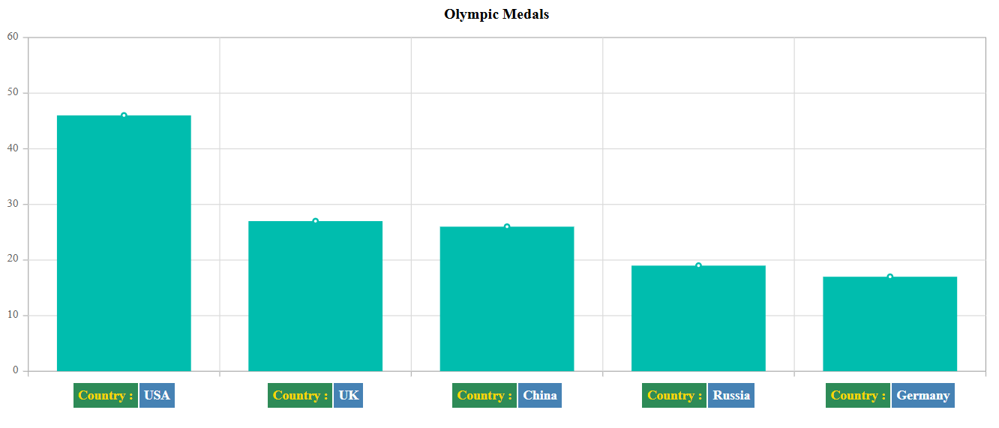

# Axis Labels in ASP.NET MVC Chart Component

## Smart Axis Labels

When the axis labels overlap with each other, you can use [`LabelIntersectAction`](https://help.syncfusion.com/cr/aspnetcore-js2/Syncfusion.EJ2.Charts.ChartAxis.html#Syncfusion_EJ2_Charts_ChartAxis_LabelIntersectAction) property in the axis, to place them smartly.

When setting `LabelIntersectAction` as `Hide`










When setting `LabelIntersectAction` as `Rotate45`










When setting `LabelIntersectAction` as `Rotate90`










## Axis Labels Positioning

By default, the axis labels can be placed at `Outside` the axis line and this also can be placed at `Inside` the axis line using the `LabelPosition` property.










## Multilevel Labels

Any number of levels of labels can be added to an axis using the `MultiLevelLabels` property. This property can be configured using the following properties:

• Categories
• Overflow
• Alignment
• Text style
• Border

### Categories

Using the categories property, you can configure the `Start`, `End`, `Text`, and `MaximumTextWidth` of multilevel labels.










### Overflow

Using the `Overflow` property, you can `Trim` or `Wrap` the multilevel labels.










### Alignment

The `Alignment` property provides option to position the multilevel labels at `Far`, `Center`, or `Near`.










### Text customization

The `TextStyle` property of multilevel labels provides options to customize the `Size`, `Color`, `FontFamily`, `FontWeight`, `FontStyle`, `Opacity`, `TextAlignment` and `TextOverflow`.










### Border customization

Using the `Border` property, you can customize the `Width`, `Color`, and `Type`. The `Type` of border are `Rectangle`, `Brace`, `WithoutBorder`, `WithoutTopBorder`, `WithoutTopandBottomBorder` and `CurlyBrace`.










## Edge Label Placement

Labels with long text at the edges of an axis may appear partially in the chart. To avoid this, use [`EdgeLabelPlacement`](https://help.syncfusion.com/cr/aspnetcore-js2/Syncfusion.EJ2.Charts.ChartAxis.html#Syncfusion_EJ2_Charts_ChartAxis_EdgeLabelPlacement) property in axis, which moves the label inside the chart area for better appearance or hides it. By default, the [`EdgeLabelPlacement`](https://help.syncfusion.com/cr/aspnetcore-js2/Syncfusion.EJ2.Charts.ChartAxis.html#Syncfusion_EJ2_Charts_ChartAxis_EdgeLabelPlacement) property is set to **Shift** to ensure that labels are shifted inside the chart area, avoiding any overlap or coincidence.










## Labels Customization

The [`LabelStyle`](https://help.syncfusion.com/cr/aspnetcore-js2/Syncfusion.EJ2.Charts.ChartAxis.html#Syncfusion_EJ2_Charts_ChartAxis_LabelStyle) property of an axis provides options to customize the `Color`, `Font-family`, `Font-size` and `Font-weight` of the axis labels.










## Customizing Specific Point

You can customize the specific text in the axis labels using `AxisLabelRender` event.










## Trim using maximum label width

You can trim the label using [`EnableTrim`](https://help.syncfusion.com/cr/aspnetcore-js2/Syncfusion.EJ2.Charts.ChartAxis.html#Syncfusion_EJ2_Charts_ChartAxis_EnableTrim) property and width of the labels can also be customized using [`MaximumLabelWidth`](https://help.syncfusion.com/cr/aspnetcore-js2/Syncfusion.EJ2.Charts.ChartAxis.html#Syncfusion_EJ2_Charts_ChartAxis_MaximumLabelWidth) property in the axis, the value maximum label width is `34` by default.










## Line break support

Line break feature used to customize the long axis label text into multiple lines by using ` ` tag. Refer the below example in that dataSource x value contains long text, it breaks into two lines by using ` ` tag.










## Maximum Labels

`MaximumLabels` property is set, then the labels will be rendered based on the count in the property per 100 pixel. If you have set range (minimum, maximum, interval) and maximumLabels, then the priority goes to range only. If you haven’t set the range, then we have considered priority to maximumLabels property.










## Axis label template

The axis label template allows you to customize axis labels by formatting them with HTML content, applying conditional styling, and including dynamic elements such as icons, images or additional data. This customization is enabled by setting the template content in the `LabelTemplate` property of the [ChartAxis](https://help.syncfusion.com/cr/aspnetcore-js2/Syncfusion.EJ2.Charts.ChartAxis.html).










