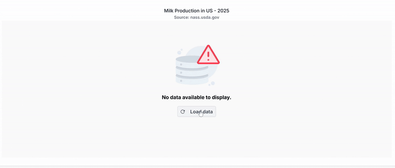

<!-- markdownlint-disable MD036 -->

# Working with data in ASP.NET MVC Chart Component

Chart can visualize data bound from local or remote data.

## Local data

You can bind a simple JSON data to the chart using [`DataSource`](https://help.syncfusion.com/cr/aspnetmvc-js2/Syncfusion.EJ2.Charts.ChartSeries.html#Syncfusion_EJ2_Charts_ChartSeries_DataSource) property in series. Now map the fields in JSON to [`XName`](https://help.syncfusion.com/cr/aspnetmvc-js2/Syncfusion.EJ2.Charts.ChartSeries.html#Syncfusion_EJ2_Charts_ChartSeries_XName) and [`YName`](https://help.syncfusion.com/cr/aspnetmvc-js2/Syncfusion.EJ2.Charts.ChartSeries.html#Syncfusion_EJ2_Charts_ChartSeries_YName) properties.











### Common datasource

You can also bind a JSON data common to all series using [`DataSource`](https://help.syncfusion.com/cr/aspnetmvc-js2/Syncfusion.EJ2.Charts.ChartSeries.html#Syncfusion_EJ2_Charts_ChartSeries_DataSource) property in chart.











## Remote data

You can also bind remote data to the chart using `DataManager`. The DataManager requires minimal information like webservice URL, adaptor and crossDomain to interact with service endpoint properly. Assign the instance of DataManager to the [`DataSource`](https://help.syncfusion.com/cr/aspnetmvc-js2/Syncfusion.EJ2.Charts.ChartSeries.html#Syncfusion_EJ2_Charts_ChartSeries_DataSource) property in series and map the fields of data to [`XName`](https://help.syncfusion.com/cr/aspnetmvc-js2/Syncfusion.EJ2.Charts.ChartSeries.html#Syncfusion_EJ2_Charts_ChartSeries_XName) and [`YName`](https://help.syncfusion.com/cr/aspnetmvc-js2/Syncfusion.EJ2.Charts.ChartSeries.html#Syncfusion_EJ2_Charts_ChartSeries_YName) properties. You can also use the [`Query`](https://help.syncfusion.com/cr/aspnetmvc-js2/Syncfusion.EJ2.Charts.ChartSeries.html#Syncfusion_EJ2_Charts_ChartSeries_Query) property of the series to filter the data.











## Binding data using ODataAdaptor

[`OData`](http://www.odata.org/documentation/odata-version-3-0/) is a standardized protocol for creating and consuming data. You can retrieve data from an OData service using the DataManager. Refer to the following code example for remote data binding using an OData service.











## Binding data using ODataV4Adaptor

ODataV4 is an improved version of the OData protocols, and the `DataManager` can also retrieve and consume ODataV4 services. For more details on ODataV4 services, refer to the [`odata documentation`](http://docs.oasis-open.org/odata/odata/v4.0/errata03/os/complete/part1-protocol/odata-v4.0-errata03-os-part1-protocol-complete.html#_Toc453752197). To bind an ODataV4 service, use the **ODataV4Adaptor**.











## Web API adaptor

You can use the **WebApiAdaptor** to bind the chart with a Web API created using an OData endpoint.










The response object should contain the properties **Items** and **Count**, where **Items** represents a collection of entities, and **Count** represents the total number of entities.

The sample response object should appear as follows:

```
{
    Items: [{..}, {..}, {..}, ...],
    Count: 830
}
```


## Custom adaptor

You can create your own adaptor by extending the built-in adaptors. The following demonstrates the custom adaptor approach and how to add a serial number to the records by overriding the built-in response processing using the **processResponse** method of the **ODataAdaptor**.











## Offline mode

When using remote data binding, all chart actions will be processed on the server-side. To avoid postback for every action, configure the chart to load all data upon initialization and handle actions on the client-side. To enable this behavior, utilize the **offline** property of the `DataManager`.











## Empty points

The Data points that uses the `null` or `undefined` as value are considered as empty points. Empty data points are ignored and not plotted in the Chart. When the data is provided by using the points property, By using `EmptyPointSettings` property in series, you can customize the empty point. Default `Mode` of the empty point is `Gap`.











## Lazy loading

Lazy loading allows you to load data for chart on demand. Chart will fire the scrollEnd event, in that we can get the minimum and maximum range of the axis, based on this, we can upload the data to chart.











**Customizing empty point**

Specific color for empty point can be set by `Fill` property in `EmptyPointSettings`. Border for a empty point can be set by `Border` property.










## Handling No Data

When no data is available to render in the chart, the `NoDataTemplate` property can be used to display a custom layout within the chart area. This layout may include a message indicating the absence of data, a relevant image, or a button to initiate data loading. Styled text, images, or interactive elements can be incorporated to maintain design consistency and improve user guidance. Once data becomes available, the chart automatically updates to display the appropriate visualization.










