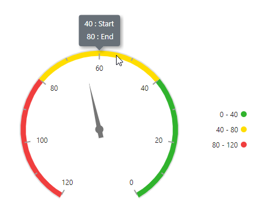

# Internationalization in Circular Gauge Control

Circular Gauge provides internationalization support for below elements.

* Axis Labels
* Tooltip

For more information about number formatter, you can refer [internationalization](https://ej2.syncfusion.com/aspnetmvc/documentation/common/internationalization).

## Globalization

Globalization is the process of designing and developing a component that works in different cultures/locales.

Internationalization library is used to globalize number in CircularGauge component using [Format](https://help.syncfusion.com/cr/aspnetmvc-js2/Syncfusion.EJ2.CircularGauge.CircularGaugeLabel.html#Syncfusion_EJ2_CircularGauge_CircularGaugeLabel_Format) property in [LabelStyle](https://help.syncfusion.com/cr/aspnetmvc-js2/Syncfusion.EJ2.CircularGauge.CircularGaugeLabel.html).

<!-- markdownlint-disable MD036 -->
**Numeric Format**

In the below example axis labels are globalized to **EUR**.










## Right-to-left

Circular Gauge can render its elements from right to left, which improves the user experience for certain language users. To do so, set the [EnableRtl](https://help.syncfusion.com/cr/aspnetmvc-js2/Syncfusion.EJ2.CircularGauge.CircularGauge.html#Syncfusion_EJ2_CircularGauge_CircularGauge_EnableRtl) property to **true**. When this property is enabled, elements such as the tooltip and legend will be rendered from right to left. Meanwhile, the axis can be rendered from right to left by setting the [Direction](https://help.syncfusion.com/cr/aspnetmvc-js2/Syncfusion.EJ2.CircularGauge.CircularGaugeAxis.html#Syncfusion_EJ2_CircularGauge_CircularGaugeAxis_Direction) property to **AntiClockWise**. For more information on axis, click [here](https://ej2.syncfusion.com/aspnetmvc/documentation/circular-gauge/gauge-axes#angles-and-direction).

The following example illustrates the right to left rendering of the Circular Gauge.










