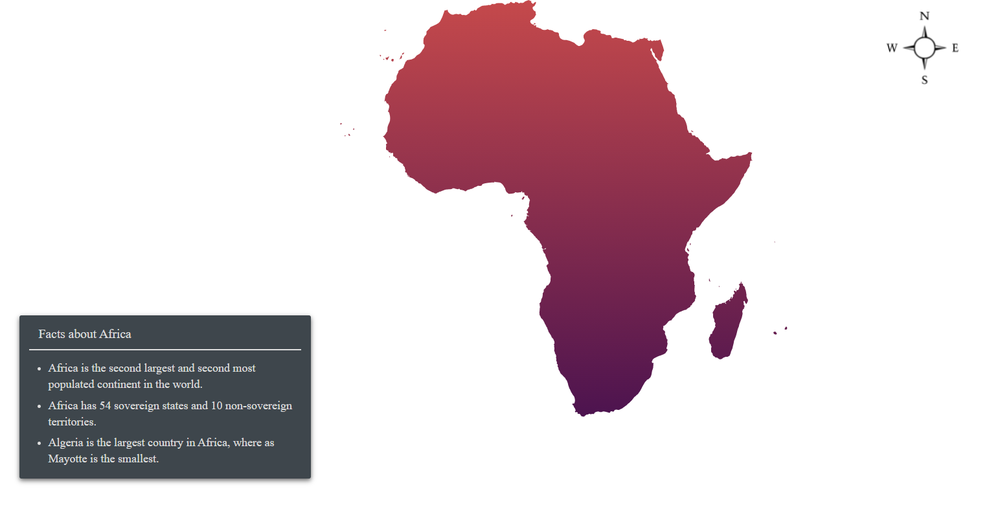

# Annotations in ASP.NET MVC Maps Component

Annotations are used to mark the specific area of interest in the Maps with texts, shapes, or images. Any number of annotations can be added to the Maps component.

Initialize the Maps component with annotation option, text content or ID of an HTML element or an HTML string can be specified to render a new element that needs to be displayed in the Maps by using the `Content` property. To specify the content position with `X` and `Y` properties as mentioned in the following example.










Note: Refer the data values for Africa(https://www.syncfusion.com/downloads/support/directtrac/general/ze/Africa1913669070) shape here.

