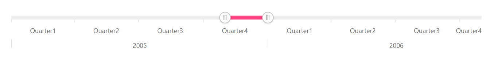
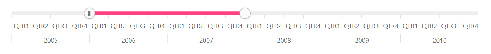
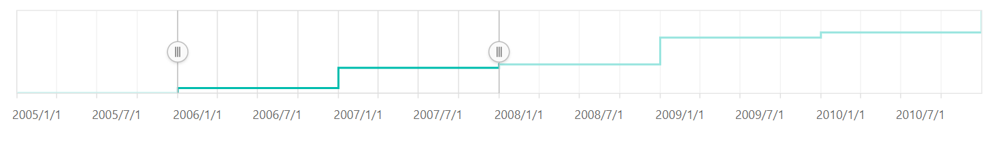
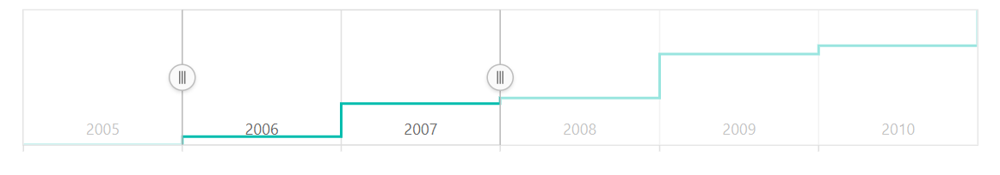
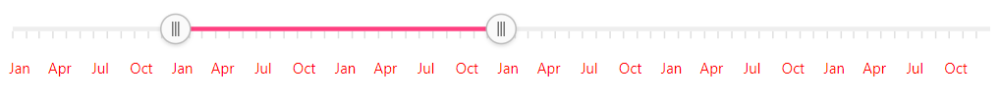

# Labels

## Multilevel labels

The multi-level labels for the Range Selector can be enabled by setting the `enableGrouping` property to **true**. This is restricted to the DateTime axis alone.










## Grouping

The multi-level labels can be grouped using the `groupBy` property with the following interval types:

* Auto
* Years
* Quarter
* Months
* Weeks
* Days
* Hours
* Minutes
* Seconds










## Smart labels

The `labelIntersectAction` property is used to avoid overlapping of labels. The following code sample shows the setting of `labelIntersectAction` property to **Hide**.










## Label positioning

By default, the labels can be placed outside the Range Selector. It can also be placed inside the Range Selector using the `labelPosition` property.










## Labels customization

The font size, color, family, etc. can be customized using the `labelStyle` setting.










