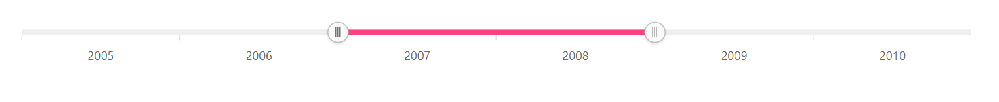

# Lightweight range navigator

By default, when the `dataSource` for `series` is empty, a lightweight Range Selector will be shown without Chart.










## See Also

* [Period Selector](./period-selector/)