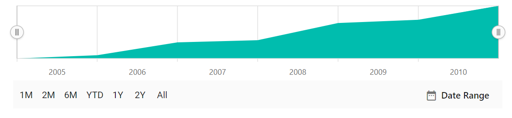
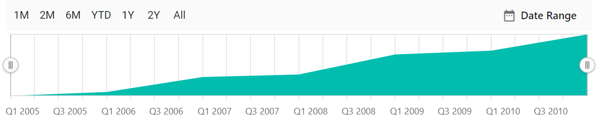
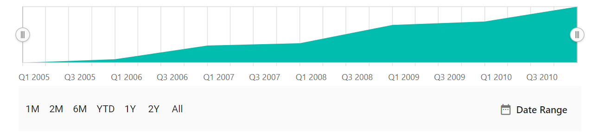

# Period selector

The period selector allows to select a range with specified periods.

## Periods

An array of objects that allows the users to specify pre-defined time intervals. The `interval` property specifies the count value of the button, and the `text` property specifies the text to be displayed on the button. The `intervaltype` property allows the users to customize the interval type, and it supports the following types:

* Auto
* Years
* Quarter
* Months
* Weeks
* Days
* Hours
* Minutes
* Seconds










## Positioning period selector

The `position` property allows the users to position the period selector at the **Top** or **Bottom**.










## Height

The `height` property allows the users to specify the height of the period selector. The default value of the height property is **43px**.










## Visibility of range navigator

The `disableRangeSelector` property allows the users to display only the period selector and not the Range Selector.










## See Also

* [LightWeight](./light-weight)