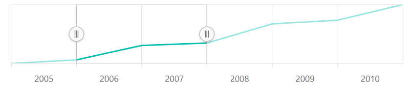
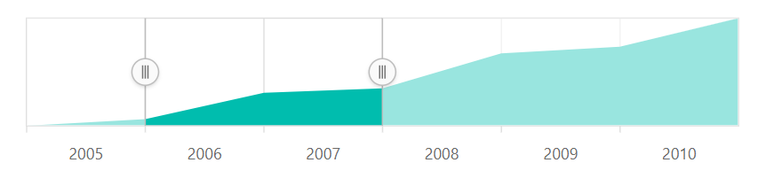
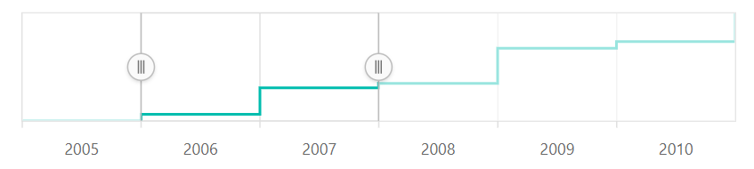
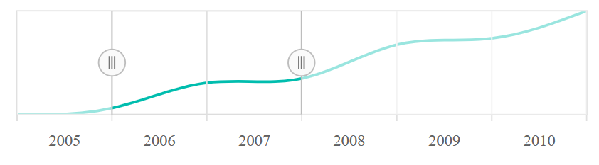
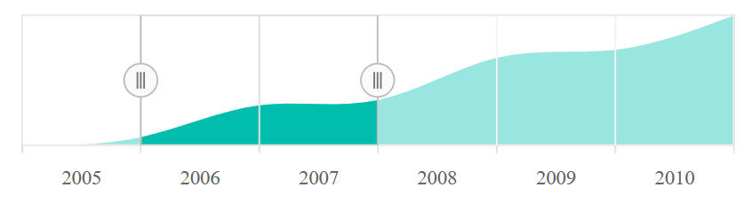

# Range Navigator Series Types

To render the data, the Range Selector supports six types of series.

<!-- markdownlint-disable MD036 -->

## Line

<!-- markdownlint-disable MD036 -->

To render a line series, use series `type` as **Line**. By default, the line series is rendered in the Range Selector.










## Area

To render an area series, use series `type` as **Area**.










## StepLine

To render a Step line series, use series `type` as **Step Line**










## Spline

To render a Spline series, use series `type` as **Spline**










## Spline Area

To render a Spline area series, use series `type` as **SplineArea**










## Column

To render a Column series, use series `type` as **Column**










