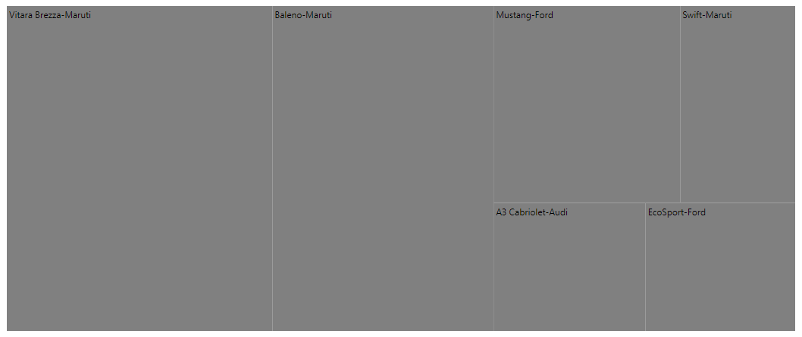
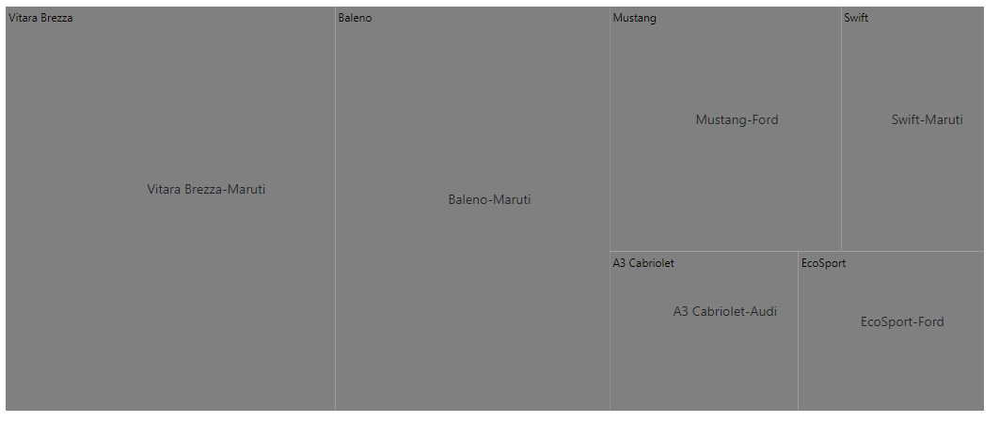
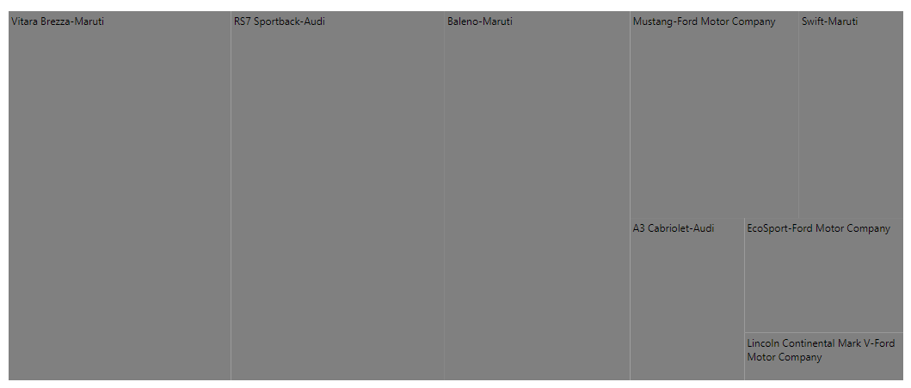

# Data Label

Data Labels are used to identify the name of items or groups in the TreeMap component. Data Labels will be shown by specifying the data source properties in the `labelPath` of the `leafItemSettings`.

## Format

Customize the labels for each item using the `labelFormat` property in the `leafItemSettings`.










## Template

The template supports customizing labels of each leaf node using the `labelTemplate` property. It uses Essential&reg; JS2 template engine to render elements and the position of templates can be customize using the `templatePosition` property.










## InterSectAction

When the label size in each item exceeds the actual size, use the `interSectAction` property in the `leafItemSettings` to customise the labels.










