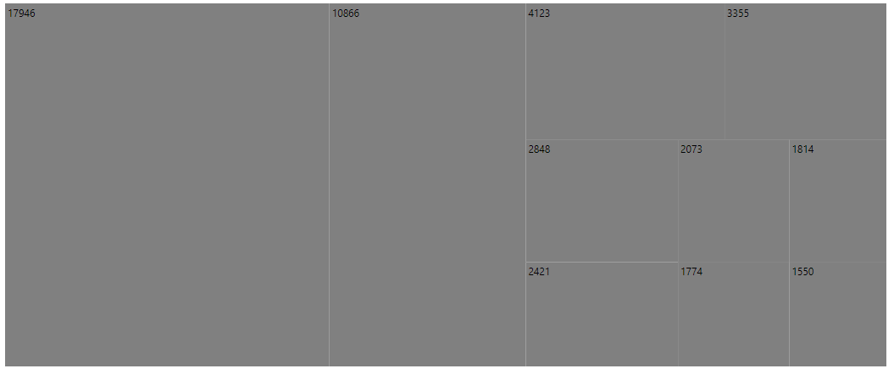
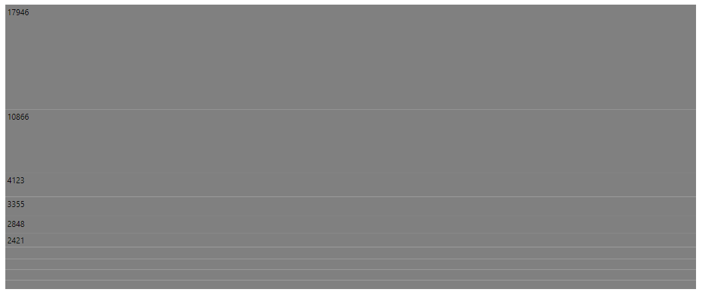
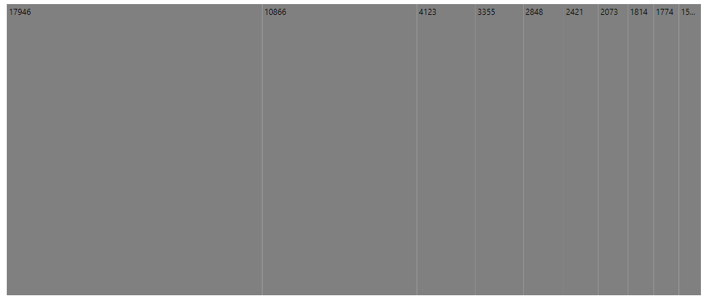
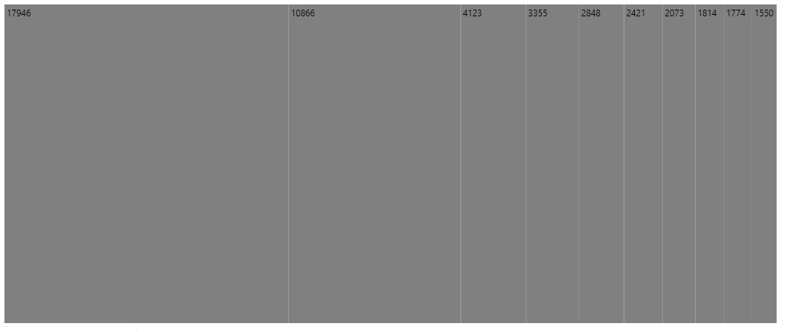
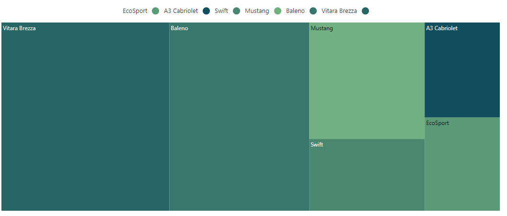
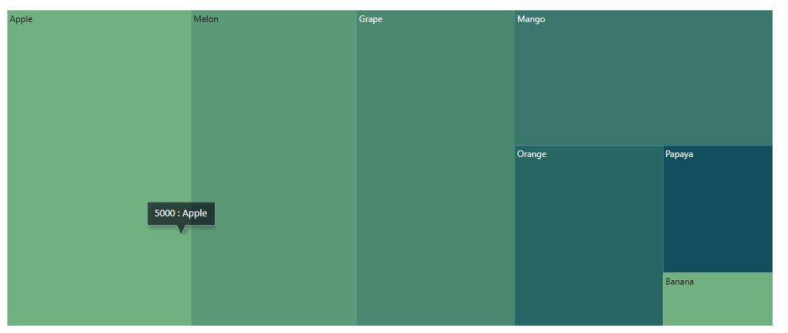
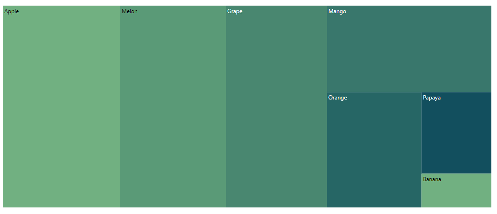
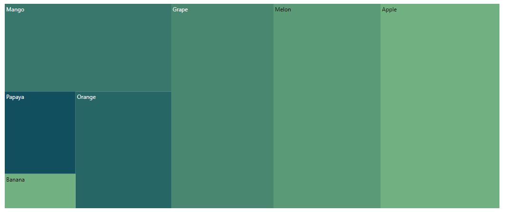
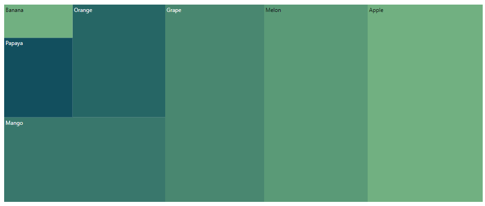
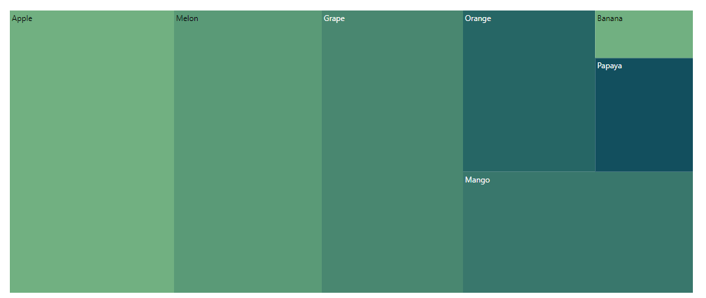

# Layout

Determine the visual representation of nodes belonging to all the TreeMap levels using the `layoutType` property.

## Types of layout

The available layout types are,

* Squarified
* SliceAndDiceVertical
* SliceAndDiceHorizontal
* SliceAndDiceAuto

### Squarified

The `Squarified` layout displays the nested rectangles based on aspect ratio in the TreeMap. The rectangles will be split based on the height and width of the parent. The default rendering type of layout is `Squarified`.










### SliceAndDiceVertical

The `SliceAndDiceVertical` layout creates rectangles with high aspect ratio and displays items in a vertically sorted order.










### SliceAndDiceHorizontal

The `SliceAndDiceHorizontal` layout creates rectangles with high aspect ratio and displays items in a horizontally sorted order.










### SliceAndDiceAuto

The `SliceAndDiceAuto` layout creates rectangles with high aspect ratio and display items sorted both horizontally and vertically.










## Right-to-left rendering

The TreeMap control supports right-to-left rendering for all its elements such as nodes, tooltip, data labels, and legends.

## Legend with Rtl support

If you set the `enableRtl` property to true, then the legend icon will be rendered on the right and the legend text will be rendered on the left of the legend icon.










## Tooltip with Rtl support

If the `enableRtl` property is set to true, the tooltip data will be rendered in reverse direction.

The following example shows the format of the tooltip.










## Treemap Item Rendering Direction

The direction of TreeMap item is `TopLeftBottomRight` by default and customize the rendering direction of the TreeMap item by setting the `RenderDirection` property.

The TreeMap can be rendered in the following directions:

* TopLeftBottomRight
* TopRightBottomLeft
* BottomRightTopLeft
* BottomLeftTopRight

The following example demonstrate how to render the treemap in the RTL direction with `TopLeftBottomRight`.










The following example demonstrate how to render the treemap in the RTL direction with `TopRightBottomLeft`.










The following example demonstrate how to render the treemap in the RTL direction with `BottomRightTopLeft`.










The following example demonstrate how to render the treemap in the RTL direction with `BottomLeftTopRight`.










