# Legend

Legend is used to provide valuable information for interpreting what the TreeMap displays. The legends can be represented in various colors, shapes or other identifiers based on the data.

## Position and alignment

Legend position is used to place legend in various positions. Based on the legend position, the legend item will be aligned. For example, if the position is top or bottom, the legend items are placed by rows. If the position is left or right, the legend items are placed by columns.

The following options are available to customize the legend position:

* Top
* Bottom
* Left
* Right
* Float










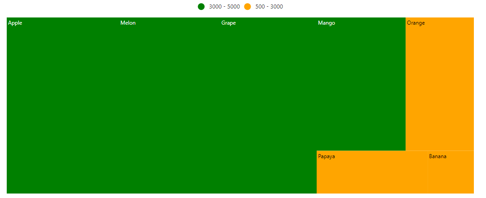

Legend Alignment is used to align the legend items in specific location. The following options are available to customize the legend alignment:

* Near
* Center
* Far










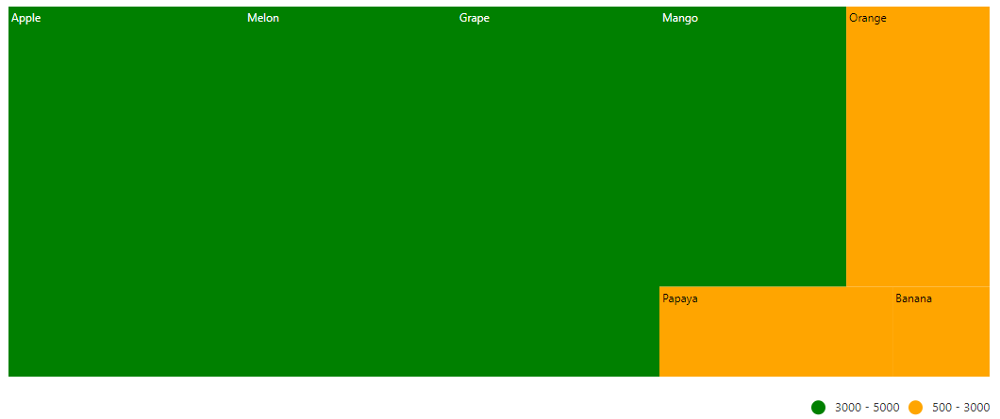

## Legend mode

The TreeMap control supports two different types of legend rendering modes such as `Default` and `Interactive`.

<!-- markdownlint-disable MD036 -->

### Default mode

In default mode, the legends have symbols with legend labels that are used to identify the items in the TreeMap.










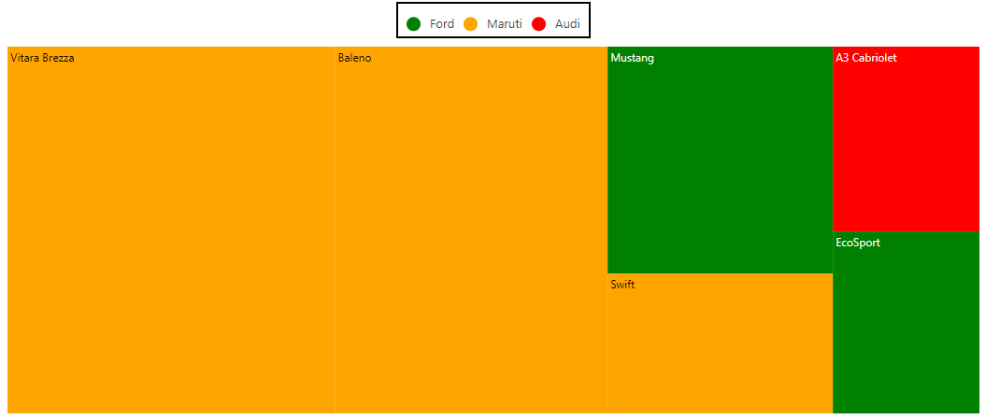

<!-- markdownlint-disable MD036 -->

### Interactive mode

The legends can be made interactive with an arrow mark that indicates exact range color in the legend when the mouse hovers on the TreeMap item. Enable this option by setting the `mode` property in the `legendSettings` to **Interactive**.










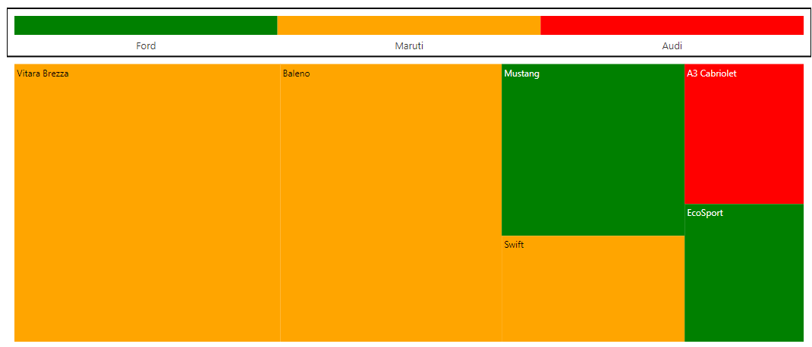

## Legend size

Customize the legend size by modifying the `height` and `width` properties in the `legendSettings`. It accepts values in both percentage and pixel.










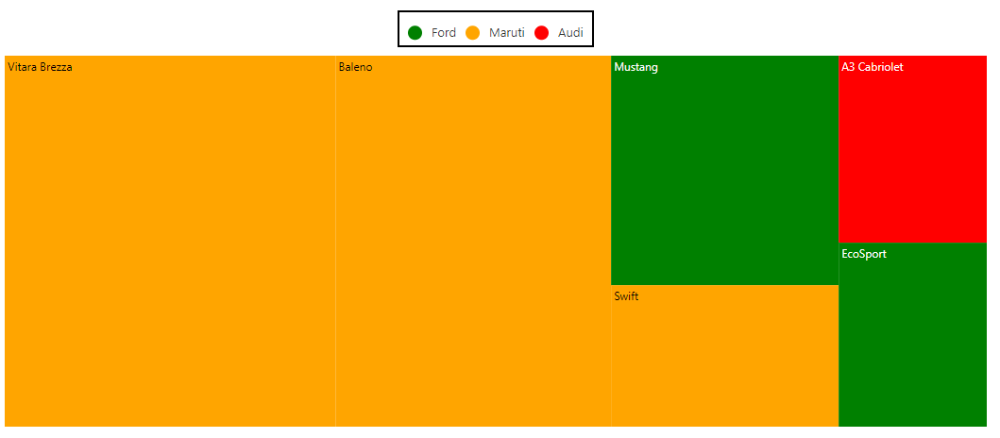

### Paging support

TreeMap support legend paging, if the legend items cannot be placed within the provided `height` and `width` of the legend.










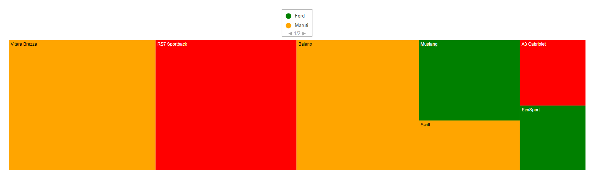

## Legend for items excluded from color mapping

Based on the mapping ranges in the data source, get the excluded ranges from the color mapping, and show the legend with the excluded range values that are bound to the specific legend.










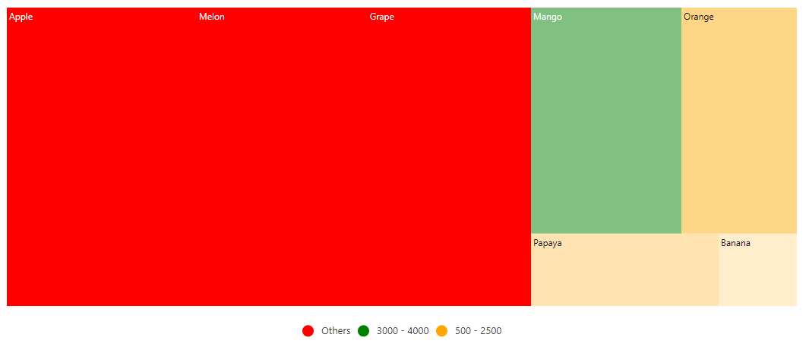

## Hide desired legend items

To enable or disable the desired legend item for each color mapping, set the `showLegend` property to **true** in the `colorMapping`.










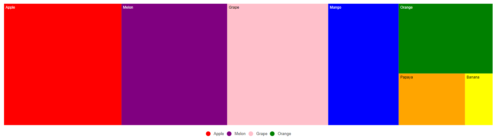

## Hide legend items based data source value

To enable or disable the legend visibility for each item through the data source, bind the appropriate data source field name to `showLegendPath` property in the `legendSettings`.










## Bind legend item text from data source

To show the legend item text from the data source, bind the property name from data source to the `valuePath` property in the `legendSettings`.










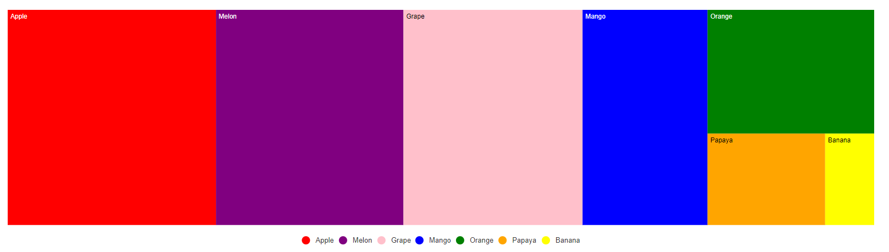

## Hide duplicate legend items

To enable or disable the duplicate legend items, set the `removeDuplicateLegend` property to **true** in the `legendSettings`.










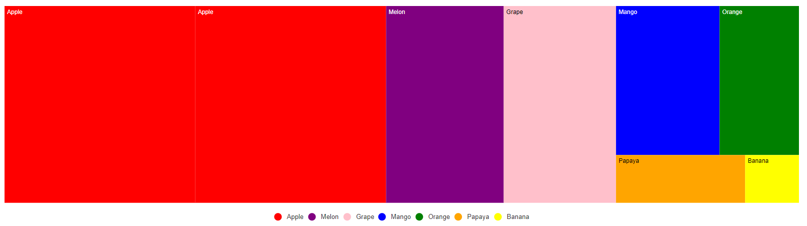

## Legend Responsiveness

Use a responsive legend that switches positions between the right and the bottom based on the available height and width. To enable the responsive legend, set the `position` property to **Auto** in the `legendSettings` and the legend position is changed based on the available height and width.










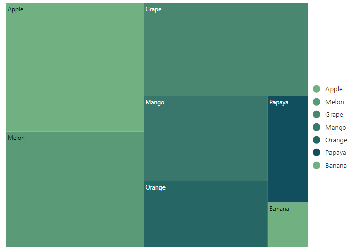