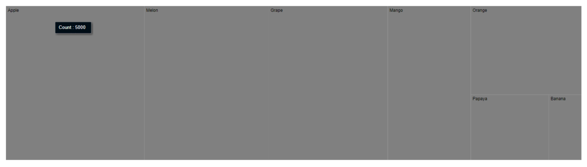
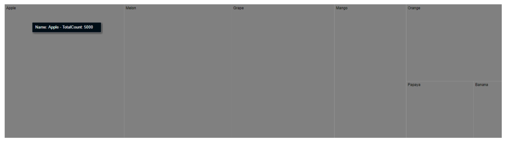
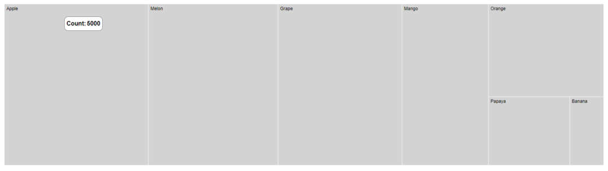

# Tooltip

Tooltip is used to display details about the items in the TreeMap. When space constraints prevent us from displaying the information using Data Labels, the tooltip comes in handy.

## Default tooltip

The tooltip is not visible by default, to make it visible, set the `visible` property in the `tooltipSettings` to **true**.










## Format tooltip

The tooltip content is displayed by default based on the `weightValuePath`. In addition, to show more information in the tooltip, use the `format` property and define field from the data source as `${datafield}`.










## Tooltip template

Tooltip can be rendered as a custom component using the `template` property in the `tooltipSettings` which accepts one or more UI elements as an input, that can be rendered as a part of the tooltip rendering. You can use `${datafield}` as placeholder in HTML element to display the values from data source.










