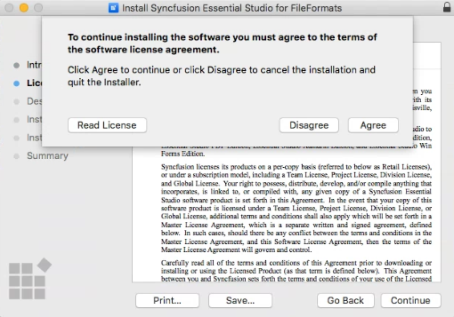
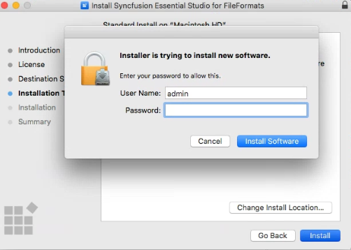
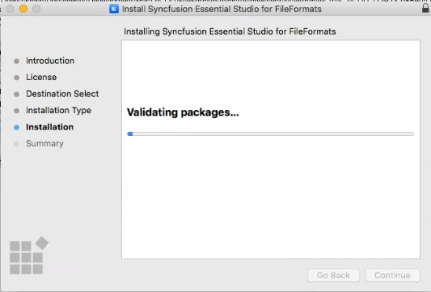

# Installing Syncfusion Chart SDK Mac installer

## Steps to resolve the warning message in Catalina OS or later

While running the Syncfusion Chart SDK Mac Installer on Catalina macOS or later, the alert below is displayed.

If you receive this alert, follow the steps below for the easiest solution.

1. Right-click the downloaded `.pkg` file in Finder.
2. Select the **Open With** option and choose **Installer (default)**. The pop-up shown below appears.

   

3. Click **Open**. The installer window opens.

## Step-by-Step Installation

The steps below show how to install the Syncfusion Chart SDK Mac Installer.

1. Open the Syncfusion Chart SDK Mac installer (.pkg) file. The installer wizard opens. Click **Continue**.

   

2. The Software License Agreement wizard appears. Click the **Continue** button.

   

3. The License Agreement confirmation window appears. If you have read the Software License Agreement, click **Agree**.

   

   N> The Unlock key is not required to install the Syncfusion Chart SDK Mac installer.

4. The Destination Select wizard appears. You can choose the disk on which to install the Syncfusion Chart SDK Mac installer.

   

5. The Installation Type wizard appears. Click **Install** to begin the standard installation of the Syncfusion Chart SDK Mac installer.

   

6. The Authentication window appears. To begin the installation, enter the Mac machine's password and click **Install Software**.

   

7. The installation process begins on your machine. Wait for it to complete.

   

8. Once the installation is complete, the completion screen is displayed. To exit the installation wizard, click **Close**.

   

   By default, the Mac installer installs the files in the following location:

   **Location:** {Documents}/Syncfusion/{version}/Chart SDK
   
   

## License Key Registration in Samples

After the installation, the license key is required to register the demo source that is included in the Mac installer. To learn about the steps for license registration for the ASP.NET Core - EJ2 samples in the Essential Studio Chart SDK Mac installer, please refer to this.

* Register the license key in the [Program.cs](https://ej2.syncfusion.com/aspnetcore/documentation/licensing/how-to-register-in-an-application#for-aspnet-core-application-using-net-60) file if you created the ASP.NET Core web application with Visual Studio 2022 and .NET 6.0.
* Register the license key in Configure method of [Startup.cs](https://ej2.syncfusion.com/aspnetcore/documentation/licensing/how-to-register-in-an-application#for-aspnet-core-application-using-net-50-or-net-31)