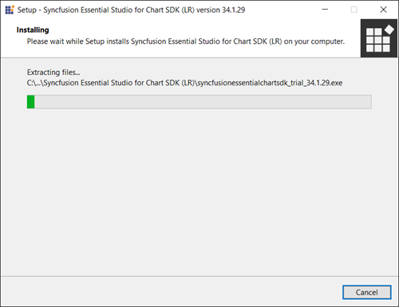
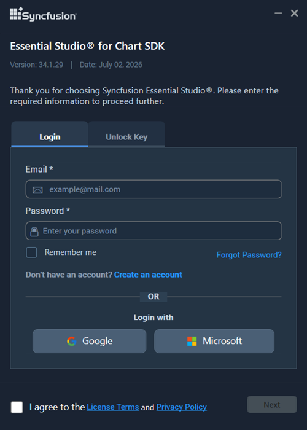
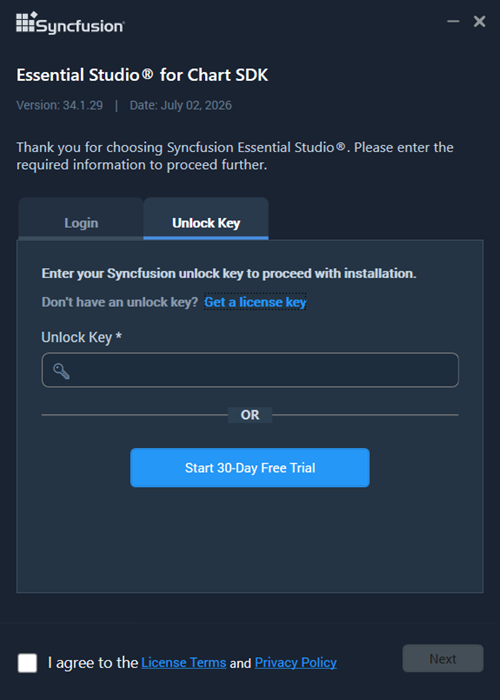
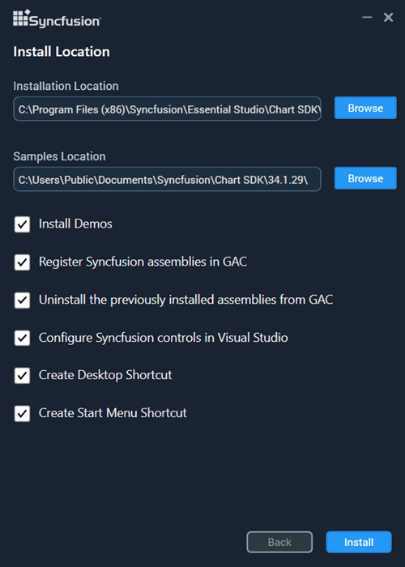
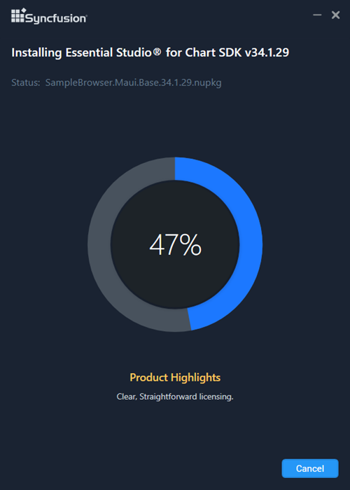
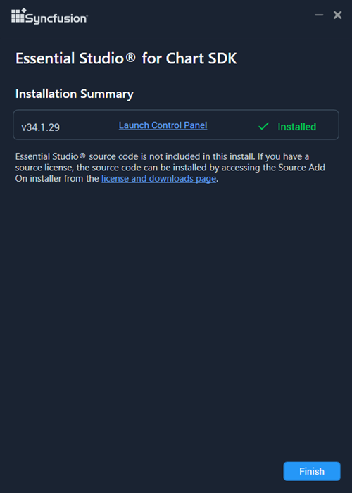

# Installing Syncfusion Chart SDK offline installer


## Installing with UI

The steps below show how to install the Syncfusion Chart SDK using the installer UI.

1. Open the Syncfusion Chart SDK Offline Installer file from the downloaded location by double-clicking it. The installer wizard automatically opens and extracts the package.

    

    N> The installer extracts the `syncfusionessentialchartsdk_(version).exe` package to a temporary directory and displays the unzip progress.

2. To unlock the Syncfusion Offline Installer, you have two options:

   - **Login to install** (recommended)
   - **Use unlock key**

   **Login to install**

   Enter your Syncfusion email address and password. If you do not have a Syncfusion account, click **Create an account** to sign up. If you have forgotten your password, click **Forgot Password** to reset it. Once you have entered your credentials, click **Next**.

   

   **Use unlock key**

   Unlock keys are platform- and version-specific. You can use either a Syncfusion licensed or a trial unlock key to unlock the Syncfusion Chart SDK installer. The trial unlock key is valid for 30 days only; the installer rejects expired trial keys.

   To learn how to generate an unlock key for both trial and licensed products, see the [Generate Unlock Key](https://www.syncfusion.com/kb/2326) Knowledge Base article.

   

3. Read the License Terms and Privacy Policy, then select the **I agree to the License Terms and Privacy Policy** check box. Click **Next**.

4. Change the install and sample locations, and configure the Additional settings as needed. Click **Install** to install with the default settings, or click **Next** to review the choices.


    

    **Additional Settings**
    
- **Install Demos** — select to install Syncfusion samples, or leave unchecked if you do not want them.
    - **Register Syncfusion Assemblies in GAC** — select to install the latest Syncfusion assemblies in the GAC, or clear if you do not want to install them.
    - **Configure Syncfusion controls in Visual Studio** — select to add the Syncfusion controls to the Visual Studio toolbox, or clear if you do not want to configure them. You must also select **Register Syncfusion Assemblies in GAC** when this option is selected.
    - **Configure Syncfusion Extensions in Visual Studio** — select to configure the Syncfusion Extensions in Visual Studio, or clear if you do not want to configure them.
    - **Create Desktop Shortcut** — select to add a desktop shortcut for the Syncfusion Control Panel.
    - **Create Start Menu Shortcut** — select to add a start menu shortcut for the Syncfusion Control Panel.


5. If any previous versions of the current product are installed, the **Uninstall Previous Version(s)** wizard opens. Select the **Uninstall** check box to remove the previous versions, then click **Proceed**.

   

   N> From the 2021 Volume 1 release, Syncfusion has added the option to uninstall previous versions (from 18.1 onward) while installing the new version.

   N> If a version is selected for uninstall, a confirmation screen appears. After confirming, the **Progress** screen displays the uninstall and install progress. If no versions are selected, only the installation progress is displayed.
   
   **Uninstall Progress**

   

   **Install Progress**

   

   N> The **Completed** screen is displayed once the Chart SDK product is installed. If a version was selected for uninstall, the completed screen displays both the install and uninstall status.

   

6. After the installation completes, click the **Launch Control Panel** link to open the Syncfusion Control Panel.

7. Click **Finish**. The Syncfusion Chart SDK is now installed on your system.

## Installing in Silent Mode

The Syncfusion Chart SDK Installer supports installation and uninstallation via the command line.

### Command Line Installation

To install through the command line in silent mode, follow the steps below.

1. Run the Syncfusion Chart SDK installer by double-clicking it. The installer wizard automatically opens and extracts the package.
2. The `syncfusionessentialchartsdk_(version).exe` file is extracted into the temporary directory.
3. Open the temporary directory by running `%temp%` in the Run dialog (`Win + R`) or in Command Prompt. The extracted `syncfusionessentialchartsdk_(version).exe` will be in one of the folders.
4. Copy the extracted `syncfusionessentialchartsdk_(version).exe` file to a stable local drive, for example `D:\Temp\`.
5. Exit the installer wizard.
6. Run Command Prompt in administrator mode and enter the following arguments.

    **Arguments:**

    ```bat
    "<installer-file-path>\SyncfusionEssentialStudio(platform)_(version).exe" /Install silent /UNLOCKKEY:"<product-unlock-key>" [/log "<log-file-path>"] [/InstallPath:<install-location>] [/InstallSamples:{true|false}] [/InstallAssemblies:{true|false}] [/UninstallExistAssemblies:{true|false}] [/InstallToolbox:{true|false}]
    ```

    N> Arguments inside the square brackets are optional.

    **Example:** “D:\Temp\syncfusionessentialchartsdk_x.x.x.x.exe” /Install silent /UNLOCKKEY:“product unlock key” /log “C:\Temp\EssentialStudio_Platform.log” /InstallPath:C:\Syncfusion\x.x.x.x /InstallSamples:true /InstallAssemblies:true /UninstallExistAssemblies:true /InstallToolbox:true

	
7.  Essential Studio for Chart SDK is installed.

    N> x.x.x.x should be replaced with the Essential Studio version and the Product Unlock Key needs to be replaced with the Unlock Key for that version.
   

### Command Line Uninstallation

The Syncfusion Chart SDK can also be uninstalled silently using the command line.

1. Run the Syncfusion Chart SDK installer by double-clicking it. The installer wizard automatically opens and extracts the package.
2. The `syncfusionessentialchartsdk_(version).exe` file is extracted into the temporary directory.
3. Open the temporary directory by running `%temp%` in the Run dialog (`Win + R`) or in Command Prompt. The extracted `syncfusionessentialchartsdk_(version).exe` will be in one of the folders.
4. Copy the extracted `syncfusionessentialchartsdk_(version).exe` file to a stable local drive, for example `D:\Temp\`.
5. Exit the installer wizard.
6. Run Command Prompt in administrator mode and enter the following arguments.

    **Arguments:**

    ```bat
    "<copied-installer-file-path>\syncfusionessentialchartsdk_(version).exe" /uninstall silent
    ```

    **Example:**

    ```bat
    "D:\Temp\syncfusionessentialchartsdk_x.x.x.x.exe" /uninstall silent
    ```

7. The Syncfusion Chart SDK is uninstalled.
   