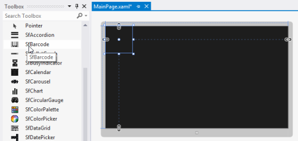

# Getting Started with WPF Barcode (SfBarcode)

## Add the Barcode control to an application

The following assembly reference is required for deploying the Barcode control.

* **Namespace**: `Syncfusion.UI.Xaml.Controls.Barcode`
* **Assembly**: `Syncfusion.SfBarcode.WPF`

To create the `SfBarcode` control in Visual Studio:

1. Create a new WPF project.

2. Drag the `SfBarcode` control from the **Toolbox** window to the Design view to create an instance of the control.

The SfBarcode control after being dragged to the Design view
{:.caption}

The following code example shows how to create the Barcode control using XAML:



<Page xmlns:sync="using:Syncfusion.UI.Xaml.Controls.Barcode">

    <Grid>

        <sync:SfBarcode x:Name="barcode" Text="http://www.syncfusion.com" Symbology="QRBarcode">

                    <sync:SfBarcode.SymbologySettings>

                        <sync:QRBarcodeSetting XDimension="8"/>

                    </sync:SfBarcode.SymbologySettings>

                </sync:SfBarcode>

    </Grid>

</Page>



## Text

The text to be encoded can be set using the `Text` property. By default, this text is displayed at the bottom of the barcode. The location of the text can be toggled between **Top** and **Bottom** using the `TextLocation` property, and its horizontal alignment can be set using the `TextAlignment` property. The text color and font can also be customized using the built-in font properties. To hide the barcode text, set the `DisplayText` property to `false`.



<sync:SfBarcode x:Name="barcode" Text="http://www.syncfusion.com" DisplayText="False" Symbology="QRBarcode"/>



## Rotation

The Barcode control can be rotated to save space using the `Rotation` property. The barcode can be rotated to 90, 180, and 270 degrees.