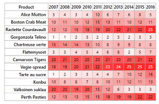

# Color mapping in the WPF HeatMap (SfHeatMap) control
Color mapping is used to indicate values as colors instead of numerical values. For example, if a HeatMap represents data from 0 to 100, `ColorMapping` is used to specify a color for the lower value and the higher value. For any value between the two values, a medium color will automatically be chosen.

In the following example, the white color is set to value 0 and the red color is set to value 30, as shown below.

<syncfusion:ColorMappingCollection x:Key="colorMapping">
	<syncfusion:ColorMapping Value="0" Color="White"/>
	<syncfusion:ColorMapping Value="30" Color="Red"/>
</syncfusion:ColorMappingCollection>


The resultant HeatMap will be as shown below.

