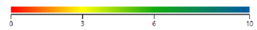
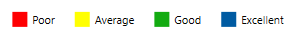
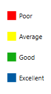

# Legend in the WPF HeatMap (SfHeatMap) control

The legend is a control used to summarize the range of colors in the HeatMap. This gives a visual guideline for mapping between value and color.

## Create a legend

A legend can be created with color mapping as shown below:



<syncfusion:ColorMappingCollection x:Key="colorMapping">
    <syncfusion:ColorMapping Value="0" Color="#fe0002" Label="Poor"/>
    <syncfusion:ColorMapping Value="3" Color="#ffff01" Label="Average"/>
    <syncfusion:ColorMapping Value="6" Color="#13ab11" Label="Good"/>
    <syncfusion:ColorMapping Value="10" Color="#005ba2" Label="Excellent"/>
</syncfusion:ColorMappingCollection>

<syncfusion:SfHeatMapLegend ColorMappingCollection="{StaticResource colorMapping}"/>



The resultant legend will be like the following image:

## Legend mode

There are two modes for the legend:

* Gradient
* List

### Gradient

<syncfusion:SfHeatMapLegend 
	LegendMode="Gradient" 
	ColorMappingCollection="{StaticResource colorMapping}"/>


### List

<syncfusion:SfHeatMapLegend
	LegendMode="List" 
	ColorMappingCollection="{StaticResource colorMapping}"/>


## Orientation

There are 2 types of orientation, applicable for Gradient and List modes:

* Horizontal
* Vertical

### Horizontal

<syncfusion:SfHeatMapLegend 
	LegendMode="List" 
	Orientation="Horizontal" 
	ColorMappingCollection="{StaticResource colorMapping}"/>


### Vertical

<syncfusion:SfHeatMapLegend 
	LegendMode="List" 
	Orientation="Vertical" 
	ColorMappingCollection="{StaticResource colorMapping}"/>


