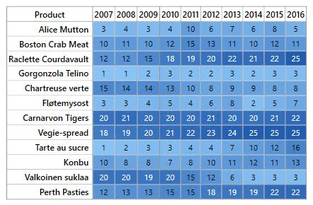

# Overview of WPF HeatMap (SfHeatMap)

**Essential® HeatMap WPF** represents tabular data values as gradient colors instead of numbers. Low and high values are represented as different colors with different gradients.

**Key features:**

* 2 types of data source mapping (`TableMapping`, `CellMapping`)
* Color mapping
* Legend
* Virtualization

