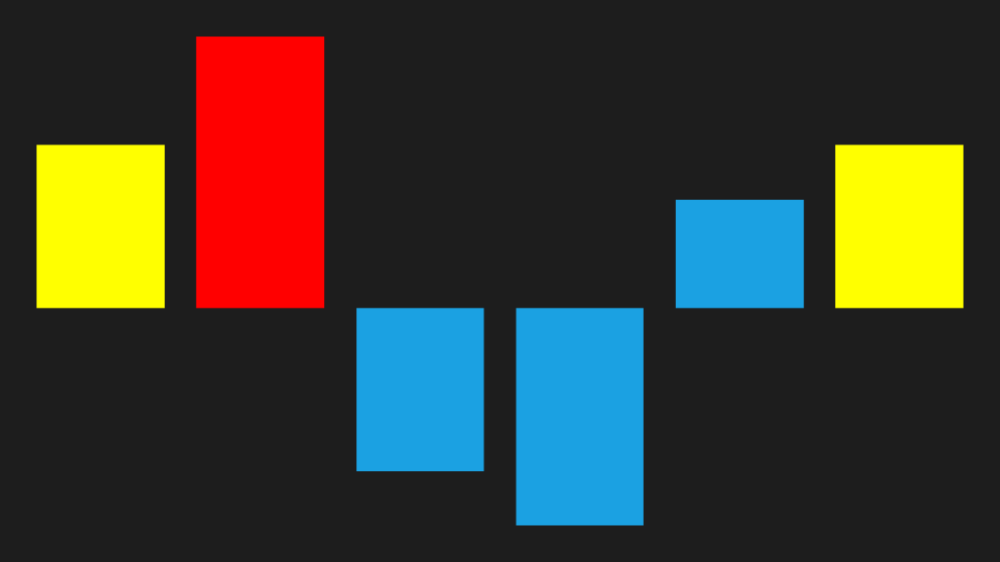

# Customize segment brush in WPF Sparkline (SfSparkline)

You can customize the first, last, negative, high, and low point brushes, similar to markers, in area and line sparklines.





 <Syncfusion:SfColumnSparkline
     ItemsSource="{Binding UsersList}"
     YBindingPath="NoOfUsers">
     
     <Syncfusion:SfColumnSparkline.SegmentTemplateSelector>
         <Syncfusion:SegmentTemplateSelector
             FirstPointBrush="Yellow"
             LastPointBrush="Yellow"
             HighPointBrush="Red"/>
     </Syncfusion:SfColumnSparkline.SegmentTemplateSelector>

 </Syncfusion:SfColumnSparkline>
		




SfColumnSparkline sparkline = new SfColumnSparkline()
{
    ItemsSource = new UsersViewModel().UsersList,
    YBindingPath = "NoOfUsers"
};

SegmentTemplateSelector selector = new SegmentTemplateSelector()
{
    FirstPointBrush = new SolidColorBrush(Colors.Yellow),
    LastPointBrush = new SolidColorBrush(Colors.Yellow),
    HighPointBrush = new SolidColorBrush(Colors.Red)
};

sparkline.SegmentTemplateSelector = selector;





The following is a snapshot of the customized segment.

