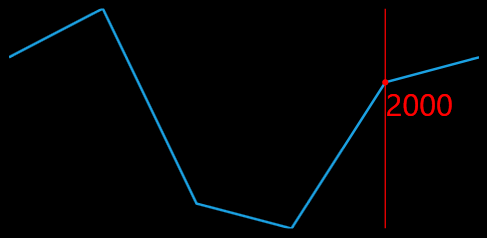

# Add labels for the track ball

You can add labels for the track ball to show the corresponding values. To add labels for the track ball, subscribe to the `OnSparklineMouseMove` event. You can get the following data from the event argument.





<Window.DataContext>
    <local:UsersViewModel/>
</Window.DataContext>

<Syncfusion:SfLineSparkline 
    ShowTrackBall="True" 
    OnSparklineMouseMove="SfLineSparkline_OnSparklineMouseMove" 
    x:Name="sparkline" 
    ItemsSource="{Binding UsersList}" 
    YBindingPath="NoOfUsers">
</Syncfusion:SfLineSparkline>





ContentPresenter info;
private void SfLineSparkline_OnSparklineMouseMove(object src, SparklineMouseMoveEventArgs args)
{
    if(!args.RootPanel.Children.Contains(info))
    {
        info = new ContentPresenter();
        args.RootPanel.Children.Add(info);
        TextBlock.SetForeground(info, new SolidColorBrush(Colors.Red));
        TextBlock.SetFontSize(info, 25);
    }

    info.Content = args.Value.Y;

    info.Arrange(new Rect(args.Coordinate.X, args.Coordinate.Y, info.ActualWidth, info.ActualHeight));
}
		




The following is a snapshot of the track ball labels.

