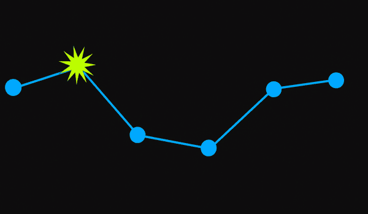

# Customize the marker for a specific data point

You can customize the marker for a specific data point with a custom template for `SfLineSparkline` and `SfAreaSparkline`. To customize the marker, inherit the `MarkerTemplateSelector` class and override the `SelectTemplate` method.





<Syncfusion:SfLineSparkline
    x:Name="sparkline"
    MarkerVisibility="Visible"
    ItemsSource="{Binding UsersList}"
    YBindingPath="NoOfUsers">

    <Syncfusion:SfLineSparkline.MarkerTemplateSelector>
        <local:CustomMarkersTemplateSelector MarkerHeight="10" MarkerWidth="10"/>
    </Syncfusion:SfLineSparkline.MarkerTemplateSelector>

</Syncfusion:SfLineSparkline>
		




public class CustomMarkersTemplateSelector : MarkerTemplateSelector
{
    protected override DataTemplate SelectTemplate(double x, double y)
    {
        if (y == MaximumY)
        {
            DataTemplate markerTemplate = Application.Current.Resources["markerTemplate"] as DataTemplate;
            return markerTemplate;
        }
        else
        {
            return base.SelectTemplate(x, y);
        }
    }
}





The following is a snapshot of the custom marker position.

