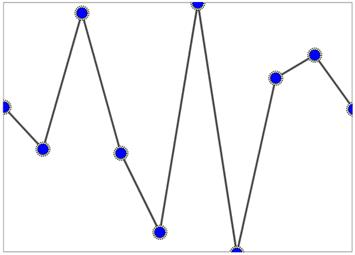

# Marker Customization in WPF Sparkline (SfSparkline)

Markers can be customized by initializing the marker template selector class. This allows differentiating the first, last, high, low, and negative points.





<Syncfusion:SfLineSparkline
    ItemsSource="{Binding UsersList}"
    MarkerVisibility="Visible"
    Padding="20"
    YBindingPath="NoOfUsers">

    <Syncfusion:SfLineSparkline.MarkerTemplateSelector>
        <Syncfusion:MarkerTemplateSelector
            FirstPointBrush="Yellow"
            LastPointBrush="Yellow"
            HighPointBrush="Red"
            MarkerHeight="15"
            MarkerWidth="15"/>
    </Syncfusion:SfLineSparkline.MarkerTemplateSelector>
</Syncfusion:SfLineSparkline>
  




SfLineSparkline sparkline = new SfLineSparkline()
{
    ItemsSource = new UsersViewModel().UsersList,
    YBindingPath = "NoOfUsers",
    MarkerVisibility = Visibility.Visible,
    Padding = new Thickness(20)
};

MarkerTemplateSelector selector = new MarkerTemplateSelector()
{
    FirstPointBrush = new SolidColorBrush(Colors.Yellow),
    LastPointBrush = new SolidColorBrush(Colors.Yellow),
    HighPointBrush = new SolidColorBrush(Colors.Red),
    MarkerHeight = 15,
    MarkerWidth = 15
};

sparkline.MarkerTemplateSelector = selector;





The following is a snapshot of the above code.

**Marker template**

You can customize the default appearance of the marker symbol by using the `MarkerTemplate` property in the sparkline.

The following code shows how to apply the template for the marker.





<Syncfusion:SfLineSparkline
    Interior="#4a4a4a"
    BorderBrush="DarkGray"
    MarkerVisibility="Visible"
    BorderThickness="1"
    ItemsSource="{Binding UsersList}"
    YBindingPath="NoOfUsers">

    <Syncfusion:SfLineSparkline.Resources>
        <DataTemplate x:Key="markerTemplate">
            <Grid>
                <Ellipse
                    Height="15"
                    Width="15"
                    Fill="LightGoldenrodYellow"
                    Stroke="Black"
                    StrokeDashArray="1,1"
                    StrokeThickness="1"/>

                <Ellipse
                    Height="12"
                    Width="12"
                    Fill="Blue"
                    Stroke="Black"
                    StrokeDashArray="1,1"
                    StrokeThickness="1"/>
            </Grid>
        </DataTemplate>
    </Syncfusion:SfLineSparkline.Resources>

    <Syncfusion:SfLineSparkline.MarkerTemplateSelector>
        <Syncfusion:MarkerTemplateSelector MarkerTemplate="{StaticResource markerTemplate}"/>
    </Syncfusion:SfLineSparkline.MarkerTemplateSelector>

</Syncfusion:SfLineSparkline>





SfLineSparkline sparkline = new SfLineSparkline()
{
	ItemsSource = new UsersViewModel().UsersList,
	YBindingPath = "NoOfUsers",
	MarkerVisibility = Visibility.Visible,
	Interior = new SolidColorBrush(Color.FromRgb(0x4a, 0x4a, 0x4a)),
	BorderBrush = new SolidColorBrush(Colors.DarkGray),
	BorderThickness = new Thickness(1)
};

MarkerTemplateSelector selector = new MarkerTemplateSelector()
{
	MarkerTemplate = sparkline.Resources["markerTemplate"] as DataTemplate
};

sparkline.MarkerTemplateSelector = selector;





